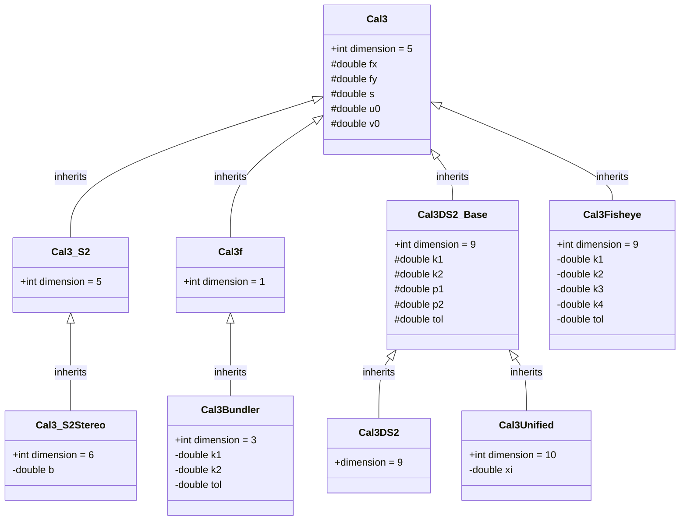

# Geometry 几何模块

`geometry`模块为GTSAM中的几何概念提供了核心类。这包括基本类型，如用于旋转和位姿的李群(Lie group)类、2D和3D点类，以及用于标定的多种相机模型。这些表示是库中许多算法的重要构建块，特别适用于推断(inference)和SLAM应用。

## 核心类型

- [Rot2](doc/Rot2.ipynb) 和 [Rot3](doc/Rot3.ipynb)：表示2D和3D旋转群(rotation group)。
- [Pose2](doc/Pose2.ipynb) 和 [Pose3](doc/Pose3.ipynb)：2D和3D中的刚体位姿(rigid body pose)。
- [Point2](https://github.com/borglab/gtsam/blob/develop/gtsam/geometry/Point2.h) 和 [Point3](https://github.com/borglab/gtsam/blob/develop/gtsam/geometry/Point3.h)：基本的2D和3D点容器。
- [Unit3](https://github.com/borglab/gtsam/blob/develop/gtsam/geometry/Unit3.h)：具有单位长度的方向向量。
- [Similarity2](https://github.com/borglab/gtsam/blob/develop/gtsam/geometry/Similarity2.h) 和 [Similarity3](https://github.com/borglab/gtsam/blob/develop/gtsam/geometry/Similarity3.h)：结合了旋转、平移和缩放的相似变换(similarity transformation)。
- [SO3](doc/SO3.ipynb)、[SO4](https://github.com/borglab/gtsam/blob/develop/gtsam/geometry/SO4.h) 和 [SOn](https://github.com/borglab/gtsam/blob/develop/gtsam/geometry/SOn.h)：通用的特殊正交群(special orthogonal group)实现。
- [Quaternion](https://github.com/borglab/gtsam/blob/develop/gtsam/geometry/Quaternion.h)：用于旋转的四元数(quaternion)封装。

## 标定模型
本节描述了GTSAM中表示不同相机标定模型的类。这些模型处理相机3D坐标系与2D图像平面之间的转换，考虑焦距(focal length)、主点(principal point)和镜头畸变(lens distortion)等内参(intrinsic parameters)。

这些模型以类层次结构组织，更专业的模型继承自基类。



### Cal3
[Cal3](https://github.com/borglab/gtsam/blob/develop/gtsam/geometry/Cal3.h)是所有标定模型的公共基类。它存储了五个标准的内参：
- `fx`, `fy`：x和y方向的焦距。
- `s`：倾斜因子(skew factor)。
- `u0`, `v0`：主点（图像中心）。

它提供基本功能，但不应直接在优化中使用，因为它本身不定义流形结构。

### Cal3_S2
[Cal3_S2](doc/Cal3_S2.ipynb)是最常见的5自由度(DOF)标定模型，专为优化设计。它在5维流形上表示Cal3的五个参数，使其可以直接用于因子图(factor graph)中。

### Cal3_S2Stereo

[Cal3_S2Stereo](https://github.com/borglab/gtsam/blob/develop/gtsam/geometry/Cal3_S2Stereo.h)扩展了`Cal3_S2`，用于双目相机。它继承了五个标准内参，并添加了第六个参数`b`作为双目基线(stereo baseline)。这形成了用于优化的6维流形。

### Cal3f

[Cal3f](https://github.com/borglab/gtsam/blob/develop/gtsam/geometry/Cal3f.h)是一个特殊的简化模型，假设零倾斜且单一焦距$f$（即$f_x = f_y$）。主点$(u_0, v_0)$也被认为是固定常量，不进行优化。

因为只有焦距$f$是变量，`Cal3f`的流形维度为1。这使得它在只需要标定焦距的场景中非常高效，因为优化空间要小得多。

### Cal3Bundler

[Cal3Bundler](https://github.com/borglab/gtsam/blob/develop/gtsam/geometry/Cal3Bundler.h)设计为与Bundler兼容，Bundler是一个用C和C++编写的无序图像集的运动推断结构(structure-from-motion, SfM)系统。它继承自`Cal3f`，并添加了两个径向畸变系数`k1`和`k2`。这使得其总共有3个自由度可用于优化。

### Cal3Fisheye

[Cal3Fisheye](https://github.com/borglab/gtsam/blob/develop/gtsam/geometry/Cal3Fisheye.h)专为鱼眼镜头相机设计，实现了OpenCV使用的畸变模型。它继承自基类`Cal3`，并添加了四个鱼眼特有的畸变系数：`k1`、`k2`、`k3`和`k4`。这形成了用于优化的9维流形。

### Cal3DS2_Base、Cal3DS2 和 Cal3Unified

这组类处理OpenCV指定的标准径向和切向镜头畸变。

- [Cal3DS2_Base](https://github.com/borglab/gtsam/blob/develop/gtsam/geometry/Cal3DS2_Base.h)：这是一个基类，在`Cal3`的五个标准参数基础上添加了四个畸变参数（`k1`、`k2`用于径向畸变，`p1`、`p2`用于切向畸变），总共9个参数。
- [Cal3DS2](https://github.com/borglab/gtsam/blob/develop/gtsam/geometry/Cal3DS2.h)：此类继承自`Cal3DS2_Base`，实现了必要的流形结构，使9自由度模型可用于优化。
- [Cal3Unified](https://github.com/borglab/gtsam/blob/develop/gtsam/geometry/Cal3Unified.h)：此模型用于全向相机，扩展了`Cal3DS2_Base`，添加了镜面参数`xi`。这使得参数总数达到10个，创建了用于优化的10维流形。

## 相机模型

本节描述了表示不同相机模型的类。

- 内参标定类型，如[Cal3_S2](doc/Cal3_S2.ipynb)、[Cal3Bundler](https://github.com/borglab/gtsam/blob/develop/gtsam/geometry/Cal3Bundler.h)、[Cal3_S2Stereo](https://github.com/borglab/gtsam/blob/develop/gtsam/geometry/Cal3_S2Stereo.h)、[Cal3Fisheye](https://github.com/borglab/gtsam/blob/develop/gtsam/geometry/Cal3Fisheye.h)和[Cal3Unified](https://github.com/borglab/gtsam/blob/develop/gtsam/geometry/Cal3Unified.h)。
- 相机封装类，包括[PinholeCamera](https://github.com/borglab/gtsam/blob/develop/gtsam/geometry/PinholeCamera.h)、[PinholePose](doc/PinholePose.ipynb)、[CalibratedCamera](https://github.com/borglab/gtsam/blob/develop/gtsam/geometry/CalibratedCamera.h)、[SimpleCamera](https://github.com/borglab/gtsam/blob/develop/gtsam/geometry/SimpleCamera.h)、[StereoCamera](https://github.com/borglab/gtsam/blob/develop/gtsam/geometry/StereoCamera.h)和[SphericalCamera](https://github.com/borglab/gtsam/blob/develop/gtsam/geometry/SphericalCamera.h)。
- 相关的测量类型，如[StereoPoint2](https://github.com/borglab/gtsam/blob/develop/gtsam/geometry/StereoPoint2.h)，以及用于处理相机集的工具（[PinholeSet](https://github.com/borglab/gtsam/blob/develop/gtsam/geometry/PinholeSet.h)、[CameraSet](https://github.com/borglab/gtsam/blob/develop/gtsam/geometry/CameraSet.h)）。

## 几何关系和工具

- [BearingRange](https://github.com/borglab/gtsam/blob/develop/gtsam/geometry/BearingRange.h)：关联方位(bearing)和距离(range)测量。
- [EssentialMatrix](https://github.com/borglab/gtsam/blob/develop/gtsam/geometry/EssentialMatrix.h) 和 [FundamentalMatrix](https://github.com/borglab/gtsam/blob/develop/gtsam/geometry/FundamentalMatrix.h)：双视图几何关系。
- [Line3](https://github.com/borglab/gtsam/blob/develop/gtsam/geometry/Line3.h) 和 [OrientedPlane3](https://github.com/borglab/gtsam/blob/develop/gtsam/geometry/OrientedPlane3.h)：3D中直线和平面的表示。
- 三角化和视觉工具（[triangulation](https://github.com/borglab/gtsam/blob/develop/gtsam/geometry/triangulation.h)、[Event](https://github.com/borglab/gtsam/blob/develop/gtsam/geometry/Event.h)）。

这些类为在GTSAM的其余部分中构建因子和执行计算提供了基础构件。

## Jacobians
# 通过核(Kernel)计算Jacobian...

#### ...以及它们与Frechet导数的联系
Frank Dellaert, August 2025

## 第1部分 - SO(3)核

本文说明如何使用紧凑的**核(kernel)**表示来计算SO(3)（及后续的半直积如SE(3)、SE2(3)和Gal(3)）的Jacobian。关键是许多SO(3)算子是Omega=[omega]_cross的多项式：
K(omega) = a*I +/- b(theta)*Omega + c(theta)*Omega^2, theta=||omega||。

我们称之为**核**。一旦我们可以应用K(omega)及其**关于omega的闭式导数**，就可以在各处复用它。

### SO(3)基础
令Omega = [omega]_cross, theta=||omega||。定义（Rodrigues/Eade）
A = sin(theta)/theta,
B = (1-cos(theta))/theta^2,
C = (1-A)/theta^2,
G = (1-2B)/(2*theta^2)。

小角度级数：A=1-theta^2/6+..., B=1/2-theta^2/24+..., C=1/6-theta^2/120+..., G=1/24-theta^2/720+...

三个重要的核：
- **Rodrigues核**：C(omega) = exp(+/-Omega) = I +/- A*Omega + B*Omega^2。
- **Jacobian核**：J(omega) = I +/- B*Omega + C*Omega^2。
- **位置/二阶核**：Gamma(omega) = 1/2 I +/- C*Omega + G*Omega^2。

### 应用核：y = K(omega) v
对于任意R^3中的v，我们可以显式计算3x3矩阵K(omega)并相乘，
k(omega,v) = K(omega) v = a v + b*(Omega v) + c*(Omega^2 v)。
*或者*利用Omega v = omega x v和Omega^2 v = omega x (omega x v) = (omega.v)*omega - ||omega||^2 v来写
k(omega, v) = a v + b (omega x v) + c ((omega.v)*omega - ||omega||^2 v)。

### K(omega) v的闭式导数
记**径向导数**d_b = b'(theta)/theta, d_c = c'(theta)/theta。则k(.,.)关于其两个参数的Jacobian为：
partial_y / partial_omega = (d_b Omega v + d_c Omega^2 v) omega^T - b [v]_cross + c (omega v^T + (omega.v) I - 2 v omega^T)
partial_y / partial_v = a I + b Omega + c Omega^2 = K(omega)。

### GTSAM核API
GTSAM实现围绕`gtsam::so3`命名空间中的两个概念：`ExpmapFunctor`和`DexpFunctor`。

`so3::ExpmapFunctor`类是一个上下文对象，为特定的旋转向量`omega`构造。它高效地缓存几何量如theta、Omega=[omega]_cross和Omega^2，并通过`expmap()`提供旋转矩阵R(omega)。

`so3::DexpFunctor`类建立在`ExpmapFunctor`之上，在需要时惰性计算系数A, B, C, ...及其导数。它为各种SO(3)操作提供核：
- `Rodrigues()`：返回SO(3)指数映射exp(+/-Omega)的核。
- `Jacobian()`：返回SO(3) Jacobian J_l, J_r的核。
- `InvJacobian()`：返回逆Jacobian J_l^{-1}, J_r^{-1}的核。
- `Gamma()`：返回"二阶"Gamma矩阵的核。

`so3::Kernel`结构体，由`DexpFunctor`产生，持有a, b, c系数及其径向导数。它提供应用核和计算其导数的核心功能。
```c++
struct GTSAM_EXPORT Kernel {
  // ... fields a, b, c, db, dc ...

  Matrix3 left() const;   // a I + b W + c WW
  Matrix3 right() const;  // a I - b W + c WW

  Vector3 applyLeft(const Vector3& v, OptionalJacobian<3, 3> Hw = {},
                    OptionalJacobian<3, 3> Hv = {}) const;
  Vector3 applyRight(const Vector3& v, OptionalJacobian<3, 3> Hw = {},
                     OptionalJacobian<3, 3> Hv = {}) const;
};
```

### 在其他群中使用核：SE(3)示例
在SE(3)中，我们复用了SO(3)的**核**。核视角强调非对角块仅仅是第1部分中dK(omega)/d_omega应用在平移向量上的导数。在API中，这恰好是`apply()`方法在其Jacobian `H1`中返回的内容。

**右Jacobian**具有以下分块形式：
J_r^{SE(3)}(omega,rho) = [[J_r(omega), 0], [Q_r(omega,rho), J_r(omega)]]。

非对角块Q_r通过将SO(3)核J_r应用于平移向量并取关于omega的导数得到。在API中，这对应于对核调用`apply()`，其中Jacobian `H1`捕获了非对角块的导数。这种方法利用了第1部分中开发的闭式核导数，无需额外的级数或积分。

此外，从旋转矩阵和平移构造SE(3)对象引入了另一个R^T。这导致Q_r块的以下表达式：
Q_r(omega, rho) = R^T . scriptL_{J_r}(Omega)[ -[rho]_cross ]，
其中Q_r在体坐标系(body frame)中表示，R^T = exp(-Omega)确保正确的坐标变换。

## 第2部分 - 群Jacobian食谱

有了第1部分的理论基础，我们现在有了一个强大的配方。我们知道对于半直积，Jacobian是分块三角的，非对角块由相应SO(3)核的Frechet导数给出。这使我们能够使用简单的核构建块来构造复杂群的Jacobian。

本节为几个常见群提供实用的"食谱"。对于每个群，我们将：
1.  定义切向量xi和指数映射exp(xi)。
2.  展示右Jacobian J_r(xi)的分块结构。
3.  提供每个块的公式。

### SE(3) - 特殊欧几里得群(Special Euclidean Group)

刚体运动群。本节采用GTSAM为其`Pose3`类使用的约定，该约定在物理上由积分体质心速度(biody-centric velocity)得到。

-   **切向量：** xi = (omega, v)，属于R^6，其中omega是角速度，v是线速度，均在体坐标系中表示。
-   **指数映射：** 该映射使用SO(3)的**左Jacobian**来计算最终平移，对应于积分体固连速度v。
    exp(xi) = (R, t)，其中 R = exp(omega), t = J_l(omega) v
-   **右Jacobian结构：** 我们旨在计算**右Jacobian** J_r(xi)，它将体坐标系中的扰动与最终位姿关联起来。这是GTSAM中不确定性传播的标准约定。
    J_r(xi) = [[J_r(omega), 0], [Q_r(omega, v), J_r(omega)]]

-   **分块公式：** 对角块是SO(3)的标准右Jacobian J_r(omega)。非对角块Q_r需要一个两步过程来推导：
    1.  **世界坐标系导数(Q_l)：** 首先，我们计算平移t关于旋转omega的导数。由于t是世界坐标系中的点，该导数也在世界坐标系中。根据定义，这是SE(3)的**左Jacobian**的非对角块，我们称之为Q_l。它使用J_l核的Frechet导数计算。
        Q_l = partial_t / partial_omega = partial(J_l(omega) v) / partial_omega = scriptL_{J_l}(Omega)[ -[v]_cross ]
        在GTSAM API中，这是`local.Jl().applyFrechet(v)`，或通过`applyLeftJacobian`的`OptionalJacobian`参数获得。

    2.  **坐标系变换：** 要获得右Jacobian所需的Q_r，我们必须将此世界坐标系导数变换到体坐标系。这通过左乘R^T = exp(-Omega)完成。
        Q_r(omega, v) = R^T . Q_l = exp(-Omega) . scriptL_{J_l}(Omega)[ -[v]_cross ]
        这个两步过程是为此指数映射选择计算右Jacobian的正确且原则性的方法。

### SE_2(3) - `NavState`

GTSAM中的`NavState`类实现了机器人文献（例如Barrau, 2012）中SE_2(3)李群的一个特定且有影响力的定义。

该群对具有三个分量（旋转、位置和速度）的状态建模，这些分量并行演化，由旋转扫过。

> **注意**：*目前*在GTSAM中，我们使用T = (R,t,v)而不是Barrau等人使用的(R,v,t)约定。我们计划将来切换到那种更被接受的约定。

-   **切向量：** xi = (omega, rho, nu)，属于R^9。为与`NavState`对齐，我们使用omega为角速度、rho为位置的切向量、nu为速度的切向量的约定。

-   **指数映射：** 群结构由其李代数的`Hat`算子定义，该算子具有"平行传输"结构，左下角块为零。
    hat(xi) := [[[omega]_cross, rho, nu], [0, 0, 0], [0, 0, 0]]
    指数映射是该矩阵的标准矩阵指数，exp(xi) := exp_m(hat(xi))。这产生了`NavState`中使用的闭式表达式：
    exp(xi) = (R, t, v)，其中 { R = exp(omega), t = J_l(omega) rho, v = J_l(omega) nu }

-   **右Jacobian结构：** 我们计算该群的右Jacobian J_r(xi)。切向量顺序为(omega, rho, nu)，状态顺序为(R, t, v)。
    J_r(xi) = [[J_r(omega), 0, 0], [(J_r)_{t,omega}, (J_r)_{t,rho}, 0], [(J_r)_{v,omega}, 0, (J_r)_{v,nu}]]

-   **分块公式：**
    -   **对角块：** 对角块表示切分量对其对应状态变量的影响，在体坐标系中表示。这需要通过R^T旋转左Jacobian。
        (J_r)_{t,rho} = (J_r)_{v,nu} = R^T J_l(omega) = J_r(omega)
    -   **非对角块（旋转耦合）：** 这些块捕获旋转对平移和速度的影响。逻辑与SE(3)相同：我们计算世界坐标系导数（左Jacobian的Frechet导数）并将其旋转到体坐标系。
        (J_r)_{t,omega} = R^T . partial(J_l(omega) rho) / partial_omega = R^T . scriptL_{J_l}(Omega)[ -[rho]_cross ]
        (J_r)_{v,omega} = R^T . partial(J_l(omega) nu) / partial_omega = R^T . scriptL_{J_l}(Omega)[ -[nu]_cross ]

### Gal(3) - 伽利略群(Galilean group)

`Gal3`类实现了伽利略相对论，为SE_2(3)添加了时间。其在GTSAM中实现和测试的Jacobian是形式李理论推导的结果。

-   **切向量：** xi = (omega, nu, rho, alpha)，属于R^10。
    -   omega：角速度
    -   nu：速度切向量
    -   rho：位置切向量
    -   alpha：时间间隔

-   **指数映射：** 状态顺序 = (R, v, p, t)。
    exp(xi) = (R, v, p, t)，其中 { R = exp(omega), v = J_l(omega) nu, p = J_l(omega) rho + alpha Gamma_l(omega) nu, t = alpha }

-   **右Jacobian结构：** 我们计算右Jacobian J_r(xi)。切向量顺序为(omega, nu, rho, alpha)，内部状态顺序为(R, v, p, t)。
    J_r(xi) = [[J_r(omega), 0, 0, 0], [(J_r)_{v,omega}, J_r(omega), 0, 0], [(J_r)_{p,omega}, (J_r)_{p,nu}, J_r(omega), (J_r)_{p,alpha}], [(J_r)_{t,omega}, (J_r)_{t,nu}, (J_r)_{t,rho}, 1]]

-   **分块公式（按GTSAM中的实现）：**
    -   **第2行(v)：** 与SE_2(3)相同：
        (J_r)_{v,omega} = R^T . scriptL_{J_l}(Omega)[ -[nu]_cross ]
    -   **第3行(p)：** 第一个块包含两个简单的Frechet导数应用，旋转回：
        (J_r)_{p,omega} = R^T (scriptL_{J_l}(Omega)[ -[rho]_cross ] + alpha scriptL_{Gamma_l}(Omega)[ -[nu]_cross ])
        第二个是简单的，也旋转回：
        (J_r)_{p,nu} = R^T . alpha . Gamma_l(omega)
        这个导数可能出人意料，但在考虑omega, alpha对r的群作用时可以证明：
        (J_r)_{p,alpha} = -Gamma_r(omega) nu

### Sim(3) - 相似群(Similarity Group)（GTSAM约定）

GTSAM中的`Similarity3`类对涉及旋转、平移和均匀缩放变换进行建模。其指数映射由一个特化的、缩放感知的核定义，实现在`VFunctor`中。此函子动态创建一个适配特定旋转omega和对数缩放lambda的核。

-   **缩放感知核：** `VFunctor`计算三个系数`P`、`Q`和`R`，它们是旋转角theta = ||omega||和对数缩放lambda的函数。这些系数定义了一个特化的"左作用"核V_l，遵循标准的多项式结构：
    V_l(omega, lambda) = P(theta, lambda) I + Q(theta, lambda) Omega + R(theta, lambda) Omega^2
    此核由积分V_l = integral_0^1 exp(s lambda) exp(s Omega) ds定义。`VFunctor`提供此积分的闭式求值。

-   **切向量：** xi = (omega, u, lambda)，属于R^7，其中omega是角速度，u是平移的切向量，lambda是对数缩放。

-   **指数映射：** 映射使用缩放感知核V_l计算世界坐标系平移。
    exp(xi) = (R, p, s)，其中 { R = exp(omega), p = V_l(omega, lambda) u, s = exp(lambda) }

-   **右Jacobian结构：** 我们计算右Jacobian J_r(xi)。它是一个7x7矩阵，具有以下分块结构，对应于切向量顺序(omega, u, lambda)：
    J_r(xi) = [[J_r(omega), 0, 0], [(J_r)_{p,omega}, (J_r)_{p,u}, (J_r)_{p,lambda}], [0, 0, 1]]

-   **分块公式：** 逻辑保持一致：计算`Expmap`的世界坐标系导数，然后用R^T旋转到体坐标系。

    -   **(J_r)_{p,u}（平移对角）：** p = V_l u关于u的偏导数就是核矩阵V_l。然后我们将其旋转到体坐标系。
        (J_r)_{p,u} = R^T . partial_p / partial_u = R^T V_l(omega, lambda)

    -   **(J_r)_{p,omega}（旋转耦合）：** 这是关于omega的Frechet导数。`VFunctor::kernel()`方法显式计算必要的径向导数（`dQ`、`dR`）以构造有效的`so3::ABCKernel`。这使我们能够直接将Frechet机制应用于我们的特化核。
        (J_r)_{p,omega} = R^T . partial_p / partial_omega = R^T . scriptL_{V_l}(omega, lambda)[ -[u]_cross ]

    -   **(J_r)_{p,lambda}（缩放耦合）：** 这是关于标量lambda的导数。我们必须关于lambda对核本身求导：
        partial V_l / partial lambda = partial P / partial lambda I + partial Q / partial lambda Omega + partial R / partial lambda Omega^2
        这定义了一个**新核**，我们称之为W_l(omega, lambda)，其系数是P, Q, R系数关于lambda的偏导数。最终的Jacobian块是这个新核应用于`u`并旋转到体坐标系。
        (J_r)_{p,lambda} = R^T . partial_p / partial_lambda = R^T . W_l(omega, lambda) u
        这展示了Sim(3)的导数如何需要对底层`VFunctor`系数进行两种不同的导数操作：omega Jacobian的径向导数和缩放Jacobian的关于lambda的偏导数。

### API

主要为了单元测试，ABCKernel API还定义了：
```c++

  /// Frechet derivative of left-kernel K(omega) in the direction X in so(3)
  /// L_M(Omega)[X] = b X + c (Omega X + X Omega) + s (db Omega + dc Omega^2), with s = -1/2 tr(Omega X)
  Matrix3 frechet(const Matrix3& X) const;

  /// Apply Frechet derivative to vector (left specialization)
  Matrix3 applyFrechet(const Vector3& v) const;
```

对`applyFrechet`的调用应与`Jacobian().left().apply()`的`H1`导数匹配。

## 参考文献
- Eade, *Lie Groups for 2D and 3D Transformations*。
- Chirikjian, *Stochastic Models, Information Theory, and Lie Groups*, Vol. 2。
- Barfoot, *State Estimation for Robotics*。
- GTSAM源码（`ExpmapFunctor`, `ABCKernel`, `DexpFunctor`, `GammaFunctor`）。
