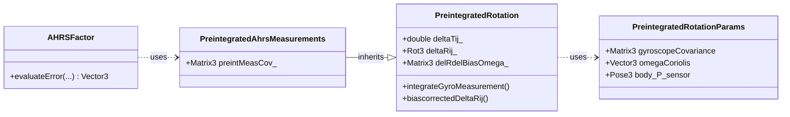
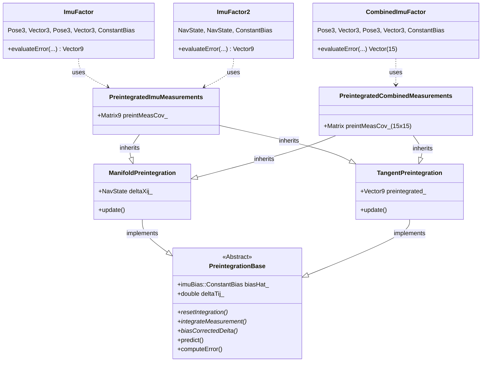
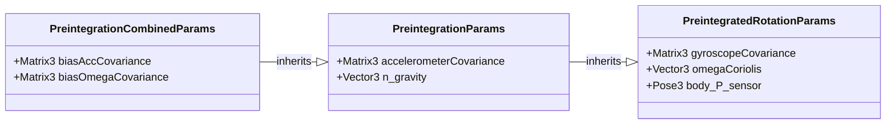

# Navigation 导航模块

GTSAM中的`navigation`模块提供了用于惯性导航、GPS集成和传感器融合的专用工具。以下是按类别组织的关键组件概述：

## 类(Classes)
### 核心导航类型

- **[NavState](https://github.com/borglab/gtsam/blob/develop/gtsam/navigation/NavState.h)**: 表示完整的导航状态$\mathcal{SE}_2(3)$，即姿态(attitude)、位置(position)和速度(velocity)。它也实现了群${SE}_2(3)$。参见[NavState用户指南](doc/NavState.ipynb)。
- **[ImuBias](https://github.com/borglab/gtsam/blob/develop/gtsam/navigation/ImuBias.h)**: 对IMU测量（加速度计和陀螺仪）中的常量偏差(bias)进行建模。

### 不变卡尔曼滤波(Invariant Kalman Filtering)

- **[ManifoldEKF](https://github.com/borglab/gtsam/blob/develop/gtsam/navigation/ManifoldEKF.h)**: 为在可微流形上操作的状态实现EKF。
- **[LieGroupEKF](https://github.com/borglab/gtsam/blob/develop/gtsam/navigation/LieGroupEKF.h)**: 为在李群上操作且具有状态依赖动态的状态实现EKF。
- **[InvariantEKF](https://github.com/borglab/gtsam/blob/develop/gtsam/navigation/InvariantEKF.h)**: 为在李群上操作且具有群复合（状态独立）动态的状态实现EKF。参见[InvariantEKF用户指南](doc/InvariantEKF.ipynb)。

### 姿态估计(Attitude Estimation)

- **[PreintegrationParams](doc/PreintegrationParams.ipynb)**: IMU预积分(preintegration)的参数。
- **[PreintegratedRotation](doc/PreintegratedRotation.ipynb)**: 处理陀螺仪测量以跟踪旋转变化。
- **[AHRSFactor](doc/AHRSFactor.ipynb)**: 姿态和航向参考系统(Attitude and Heading Reference System)因子，用于姿态估计。
- **[AttitudeFactor](doc/AttitudeFactor.ipynb)**: 从参考方向进行姿态估计的因子。

### IMU预积分（另请参见下文）

- **[PreintegrationBase](https://github.com/borglab/gtsam/blob/develop/gtsam/navigation/PreintegrationBase.h)**: IMU预积分类的基类。
- **[ManifoldPreintegration](https://github.com/borglab/gtsam/blob/develop/gtsam/navigation/ManifoldPreintegration.h)**: 使用基于流形的方法实现IMU预积分，如Forster等人的论文。
- **[TangentPreintegration](https://github.com/borglab/gtsam/blob/develop/gtsam/navigation/TangentPreintegration.h)**: 使用切空间方法实现IMU预积分，由Skydio开发。
- **[ImuFactor](doc/ImuFactor.ipynb)**: IMU因子。
- **[CombinedImuFactor](doc/CombinedImuFactor.ipynb)**: 带有内置偏差演化的IMU因子。

### GNSS集成

- **[GPSFactor](doc/GPSFactor.ipynb)**: 用于融合GPS位置测量的因子。
- **[BarometricFactor](doc/BarometricFactor.ipynb)**: 融合气压高度测量。
- **[PseudorangeFactor](doc/PseudorangeFactor.ipynb)**: 精密GNSS定位。

### 磁场集成

- **[MagFactor](doc/MagFactor.ipynb)**: 用于融合磁场测量的因子。
- **[MagPoseFactor](doc/MagPoseFactor.ipynb)**: 用于融合带有位姿约束的磁场测量的因子。

### 仿真工具

- **[Scenario](doc/Scenario.ipynb)**: 定义运动场景的基类。
- **[ConstantTwistScenario](https://github.com/borglab/gtsam/blob/develop/gtsam/navigation/Scenario.h)**: 实现恒定扭转（角速度和线速度）运动。
- **[AcceleratingScenario](https://github.com/borglab/gtsam/blob/develop/gtsam/navigation/Scenario.h)**: 实现恒定加速度运动。
- **[ScenarioRunner](doc/ScenarioRunner.ipynb)**: 执行场景并生成IMU测量。

## AHRSFactor和预积分

本节描述主要涉及姿态和航向参考系统(AHRS)的类，这些类依赖陀螺仪测量进行姿态预积分。



关键组件：

1.  **参数(`PreintegratedRotationParams`)**:
    *   存储陀螺仪积分特有的参数，包括陀螺仪噪声协方差、可选的科里奥利(Coriolis)项，以及传感器相对于体坐标系的位姿。

2.  **旋转预积分([PreintegratedRotation](doc/PreintegratedRotation.ipynb))**:
    *   处理将陀螺仪测量随时间积分以估计姿态变化(`deltaRij`)的核心逻辑。
    *   计算该积分旋转关于陀螺仪偏差(`delRdelBiasOmega`)的Jacobian。

3.  **AHRS预积分测量(`PreintegratedAhrsMeasurements`)**:
    *   继承自`PreintegratedRotation`，添加与预积分旋转相关联的协方差矩阵(`preintMeasCov_`)的计算和存储。
    *   此类专门累积`AHRSFactor`所需的信息。

4.  **AHRS因子([AHRSFactor](doc/AHRSFactor.ipynb))**:
    *   一个因子，使用`PreintegratedAhrsMeasurements`对象中累积的信息来约束两个`Rot3`姿态变量和一个`Vector3`偏差变量。
    *   它有效地测量了由积分陀螺测量预测的姿态变化与由因子的连接状态变量隐含的姿态变化之间的一致性。

## IMU因子和预积分

本节描述用于预积分完整IMU测量（加速度计和陀螺仪）以供`ImuFactor`和`CombinedImuFactor`等因子使用的类。





关键组件：

1.  **参数(`...Params`)**:
    *   `PreintegratedRotationParams`: 基础参数类（陀螺仪噪声、科里奥利力、传感器位姿）。
    *   `PreintegrationParams`: 添加加速度计噪声、重力向量、积分噪声。
    *   `PreintegrationCombinedParams`: 添加偏差随机游走协方差的参数。

2.  **预积分接口(`PreintegrationBase`)**:
    *   抽象基类，定义不同IMU预积分方法的公共接口。它管理积分期间使用的偏差估计(`biasHat_`)和时间间隔(`deltaTij_`)。
    *   定义用于积分、偏差校正和状态访问的纯虚方法。

3.  **预积分实现**:
    *   `ManifoldPreintegration`: `PreintegrationBase`的具体实现。直接在`NavState`流形上积分，将结果存储为`NavState`。对应Forster等人RSS 2015。
    *   `TangentPreintegration`: `PreintegrationBase`的具体实现。在`NavState`的9D切空间中积分增量，将结果存储为`Vector9`。

4.  **预积分测量容器**:
    *   `PreintegratedImuMeasurements`: 存储标准IMU预积分的结果及其9x9协方差(`preintMeasCov_`)。
    *   `PreintegratedCombinedMeasurements`: 类似，但为`CombinedImuFactor`设计。存储包含与偏差项相关的更大15x15协方差矩阵(`preintMeasCov_`)。

5.  **IMU因子(`...Factor`)**:
    * [ImuFactor](doc/ImuFactor.ipynb): 一个5向因子，连接前一个位姿/速度、当前位姿/速度和一个（在区间内恒定的）偏差估计。*不*对因子之间的偏差演化建模。
    * [ImuFactor2](doc/ImuFactor.ipynb): 一个3向因子，连接前一个`NavState`、当前`NavState`和一个偏差估计。功能上类似于`ImuFactor`，但使用组合的`NavState`类型。
    * [CombinedImuFactor](doc/CombinedImuFactor.ipynb): 一个6向因子，连接前一个位姿/速度、当前位姿/速度、前一个偏差和当前偏差。*包含*两个偏差状态之间偏差随机游走演化的模型。

### 重要说明
- `ImuFactor`和`Preintegrated*Measurements`使用的`DefaultPreintegrationType`的实现取决于编译标志`GTSAM_TANGENT_PREINTEGRATION`，默认为true。
    - 如果为false，使用`ManifoldPreintegration`。请使用此设置以获取{cite:t}`https://doi.org/10.1109/TRO.2016.2597321`中的精确实现。
    - 如果为true，使用`TangentPreintegration`。这在NavState流形的切空间上进行积分。
- 如果您希望使用默认之外的任何预积分类型，必须使用支持模板的类`PreintegratedImuMeasurementsT`、`ImuFactorT`、`ImuFactor2T`、`PreintegratedCombinedMeasurementsT`或`CombinedImuFactorT`，将您的PIM和因子模板化为所需的预积分类型。
- 不建议使用组合IMU因子。通常偏差演化缓慢，因此在偏差上使用一个单独的、较低频率的马尔可夫链(Markov chain)更为合适。
- 对于短时实验，甚至建议使用单个恒定偏差。偏差估计众所周知难以调试，并且也会充当任何建模误差的"吸收池"。因此，从恒定偏差开始是一个好主意，以便让管线的其余部分正常工作。

## EKF-variants EKF变体
# EKF变体

卡尔曼滤波器(Kalman Filter)是一种广泛用于具有非线性动态和测量系统的状态估计工具。扩展卡尔曼滤波器(EKF, Extended Kalman Filter)通过在当前状态估计周围线性化系统动态和测量模型来扩展经典卡尔曼滤波器，使其能够应用于广泛的现实问题。然而，EKF有局限性，如对线性化误差的敏感性，以及当状态位于可微流形或李群上时无法保持几何结构。

为了解决这些局限性，我们将探索一个超越传统EKF的类层次结构。此层次结构引入了专门的滤波器，如ManifoldEKF、LieGroupEKF和InvariantEKF，它们设计用于处理流形和李群上的状态。这些滤波器利用这些空间的数学特性来提高状态估计中的一致性、收敛性和鲁棒性。

### 类
为了将不变卡尔曼滤波器引入GTSAM，我们在```navigation```中创建了三个扩展卡尔曼滤波器类。GTSAM定义了许多可与这些滤波器一起使用的李群类。

- **[ManifoldEKF](https://github.com/borglab/gtsam/blob/develop/gtsam/navigation/ManifoldEKF.h)**: 为在可微流形上操作的状态实现EKF。
- **[LieGroupEKF](https://github.com/borglab/gtsam/blob/develop/gtsam/navigation/LieGroupEKF.h)**: 继承自```ManifoldEKF```，为在李群上操作且具有状态依赖动态的状态实现EKF。
- **[InvariantEKF](https://github.com/borglab/gtsam/blob/develop/gtsam/navigation/InvariantEKF.h)**: 继承自```LieGroupEKF```，为在李群上操作且具有群复合（状态独立）动态的状态实现EKF。
- **[leftLinearEKF](https://github.com/borglab/gtsam/blob/develop/gtsam/navigation/leftLinearEKF.h)**: 继承自```LieGroupEKF```，实现Barrau和Bonnabel提出的更通用的"左线性观测器"结构。
- **[EquivariantFilter](https://github.com/borglab/gtsam/blob/develop/gtsam/navigation/EquivariantFilter.h)**: 继承自```ManifoldEKF```，使用对称性原理实现在李群上状态估计的等变滤波器(EqF, Equivariant Filter)。

下面介绍这些滤波器背后的数学并提供使用示例。
