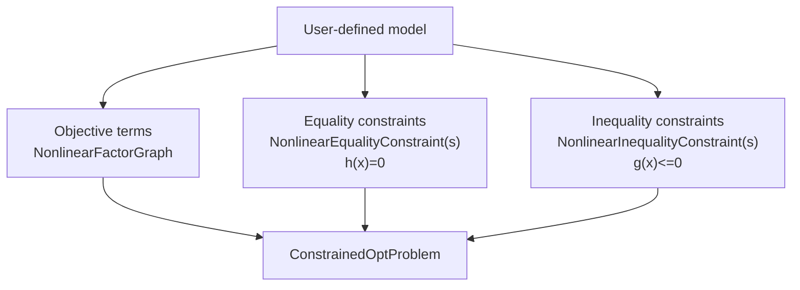
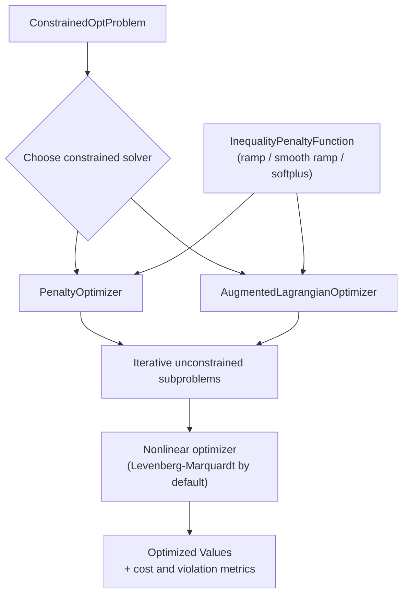

# Constrained 约束优化模块

GTSAM中的`constrained`模块在因子图之上提供了约束非线性优化。它包括用于表示约束、构建约束问题以及使用罚函数(penalty)和增广拉格朗日(augmented Lagrangian)方法求解这些问题的类。

## 核心问题模型

- [`ConstrainedOptProblem`](doc/ConstrainedOptProblem.ipynb): 持有目标代价、等式约束和不等式约束。
- [`ConstrainedOptProblem::AuxiliaryKeyGenerator`](doc/ConstrainedOptProblem.ipynb): 为转换不等式约束时使用的辅助变量生成键。
- [`NonlinearConstraint`](doc/NonlinearConstraint.ipynb): 表示为受约束的`NoiseModelFactor`对象的非线性约束基类。
- [`QpProblem`](doc/QpProblem.ipynb): 具有仿射二次代价和在直接`Vector`和`Matrix`值上的线性约束的二次规划，包括关于稀疏与稠密活动集子问题的指导。
- [`LpProblem`](doc/LpProblem.ipynb): 具有在直接`Vector`和`Matrix`值上的线性代价和线性约束的线性规划。

## 等式约束

- [`NonlinearEqualityConstraint`](doc/NonlinearEqualityConstraint.ipynb): 形式为`h(x) = 0`的约束基类。
- [`ExpressionEqualityConstraint<T>`](doc/NonlinearEqualityConstraint.ipynb): 从表达式和右侧值构造的等式约束。
- [`ZeroCostConstraint`](doc/NonlinearEqualityConstraint.ipynb): 强制代价因子的残差为零的等式约束。
- [`NonlinearEqualityConstraints`](doc/NonlinearEqualityConstraint.ipynb): 等式约束的容器图。

## 不等式约束

- [`NonlinearInequalityConstraint`](doc/NonlinearInequalityConstraint.ipynb): 形式为`g(x) <= 0`的约束基类。
- [`ScalarExpressionInequalityConstraint`](doc/NonlinearInequalityConstraint.ipynb): 基于标量表达式的不等式约束。
- [`NonlinearInequalityConstraints`](doc/NonlinearInequalityConstraint.ipynb): 不等式约束的容器图。
- [`InequalityPenaltyFunction`](doc/InequalityPenaltyFunction.ipynb): 用于不等式约束的斜坡状罚函数映射接口。
  派生类：
  - [`RampFunction`](doc/InequalityPenaltyFunction.ipynb)
  - [`SmoothRampPoly2`](doc/InequalityPenaltyFunction.ipynb)
  - [`SmoothRampPoly3`](doc/InequalityPenaltyFunction.ipynb)
  - [`SoftPlusFunction`](doc/InequalityPenaltyFunction.ipynb)

## QP和QCQP问题

- [`QpProblem`](doc/QpProblem.ipynb): 持有向量或矩阵变量上的仿射二次代价和线性等式/不等式约束。
- [`QpCost`](doc/QpProblem.ipynb): 由Hessian因子支持的仿射二次目标项。
- [`LinearConstraint`](doc/QpProblem.ipynb): 表示为等于、小于等于或大于等于的线性约束。
- [`ActiveSetSolver`](doc/QpProblem.ipynb): 活动集QP/LP求解器，具有稀疏和稠密QP子问题模式。
- [`QcqpProblem`](doc/QcqpProblem.ipynb): 持有向量或矩阵变量上的二次代价和线性/二次约束。
- [`QpCost`](doc/QcqpProblem.ipynb): 也用于QCQP目标；`QpCost(keys, Q, columnDim)`在向量或矩阵$X_i \in \mathbb{R}^{r_i \times d}$上创建纯行空间二次代价$\frac{1}{2}\sum_{ij}\operatorname{tr}(X_i^\top Q_{ij}X_j)$。
- [`QuadraticConstraint`](doc/QcqpProblem.ipynb): 标量二次约束$\operatorname{tr}(X^\top A X) \sim b$，其中$\sim$是等于、小于等于或大于等于。
- `QcqpProblem(graph, columnDim)`: 可选择加入的转换钩子，用于支持的非线性因子，这些因子可以在矩阵值QCQP变量上填充`QpCost`目标和`QuadraticConstraint`等式。
- `InsertQcqpValue<T, D>`和`InsertQcqpConstraints<T, D>`: 用于插入支持的QCQP变量值及其等式约束的辅助工具。
- `ExtractQcqpValues<T, D>`: 将精确形状的矩阵切片尽力投影回旋转。来自未锚定矩阵分量的绝对结果是规范依赖的。

在行空间`QpCost`构造中的前置因子`1/2`是故意的：它遵循GTSAM的标准因子误差约定。要表示不带`1/2`的QCQP目标，将两倍的行空间`Q`块传递给`QpCost`。

旋转转换有两条路径。`D=1`的Rot2使用精确齐次提升并支持符号固定的硬先验。在`D>=N`时，Rot2 (`D>=2`)和Rot3 (`D>=3`)使用满足$XX^\top=I$的行Stiefel变量。Between代价具有公共右$O(D)$规范。矩阵形式先验有意不支持：固定目标$\|X-[M^\top\;0]\|_F^2$会破坏该规范，不能仅由Burer--Monteiro Gram矩阵表示。未来的BM兼容降级可以引入一个锚块并使用不变代价$\|X-M^\top X_{\mathrm{anchor}}\|_F^2$。Stiefel约束不强制行列式$+1$，因此方形变量也允许反射。不受支持的因子从`NonlinearFactor::qcqpFactors`抛出。

## 优化器

- [`ConstrainedOptimizerParams`](doc/ConstrainedOptimizer.ipynb), [`ConstrainedOptimizerState`](doc/ConstrainedOptimizer.ipynb), [`ConstrainedOptimizer`](doc/ConstrainedOptimizer.ipynb): 约束求解器的共享基础接口和迭代状态。
- [`PenaltyOptimizerParams`](doc/PenaltyOptimizer.ipynb), [`PenaltyOptimizerState`](doc/PenaltyOptimizer.ipynb), [`PenaltyOptimizer`](doc/PenaltyOptimizer.ipynb): 罚函数法求解器及其参数/状态。
- [`AugmentedLagrangianParams`](doc/AugmentedLagrangianOptimizer.ipynb), [`AugmentedLagrangianState`](doc/AugmentedLagrangianOptimizer.ipynb), [`AugmentedLagrangianOptimizer`](doc/AugmentedLagrangianOptimizer.ipynb): 增广拉格朗日求解器及其参数/状态。
- [`ActiveSetSolver`](doc/QpProblem.ipynb): 用于[`QpProblem`](doc/QpProblem.ipynb)和[`LpProblem`](doc/LpProblem.ipynb)的活动集求解器，具有稀疏和稠密QP子问题模式。

## 各部分如何协同工作

对于新用户，思考两个阶段会很有帮助：

1. 构建一个约束问题。
2. 在该问题上运行约束求解器。

不等式约束可以通过`InequalityPenaltyFunction`使用不同的平滑罚函数形状（斜坡、平滑多项式斜坡或softplus），这控制活动约束边界附近的行为。

### 1) 构建问题

此阶段是关于建模：您将想要最小化的内容（目标项）与必须成立的内容（约束）分开，然后将它们组合成一个求解器可以消费的`ConstrainedOptProblem`对象。



### 2) 求解问题

此阶段是算法性的：选择一个约束求解器，在内部形成迭代无约束子问题，并使用标准非线性优化器求解这些子问题，直到约束违反量和代价降低。



## AugmentedLagrangianOptimizer 增广拉格朗日优化器
# AugmentedLagrangianOptimizer

## 概述

AugmentedLagrangianOptimizer将罚函数项与拉格朗日乘子结合起来，以改善约束非线性问题上的收敛性和条件数。

<a href="https://colab.research.google.com/github/borglab/gtsam/blob/develop/gtsam/constrained/doc/AugmentedLagrangianOptimizer.ipynb" target="_parent"></a>

GTSAM Copyright 2010-2022, Georgia Tech Research Corporation,
Atlanta, Georgia 30332-0415
All Rights Reserved

Authors: Frank Dellaert, et al. (see THANKS for the full author list)

See LICENSE for the license information

```python
try:
    import google.colab
    %pip install --quiet gtsam-develop
except ImportError:
    pass
```

## 关键概念

- AugmentedLagrangianState通过等式和不等式乘子扩展罚函数状态。
- augmentedLagrangianFunction构建每次外层迭代中使用的约束目标函数。
- 乘子更新通过双上升(dual-ascent)风格的步骤完成。
- 罚函数参数根据违反量的减少进行自适应调整。

## 数学公式

增广拉格朗日方法将乘子和罚函数结合起来：

$$
\mathcal{L}_A(x,\lambda)=\frac{1}{2}\|f(x)\|^2
-\lambda_{eq}^T h(x)+\frac{\mu_{eq}}{2}\|h(x)\|^2
-\lambda_{ineq}^T g(x)+\frac{\mu_{ineq}}{2}\|g(x)_-\|^2.
$$

求解器在原始最小化（在$x$中）和双上升更新（在乘子中）之间交替，并带有自适应罚函数更新。

## 关键用户API

- `AugmentedLagrangianOptimizer(problem, initialValues, params)`
- `optimize()`
- `progress()`
- `augmentedLagrangianFunction(state, epsilon)`（高级检查）
- `AugmentedLagrangianParams`: 双步长和罚函数自适应设置

## 简洁的C++示例

```cpp
#include <gtsam/constrained/AugmentedLagrangianOptimizer.h>

using namespace gtsam;

auto params = std::make_shared<AugmentedLagrangianParams>();
params->verbose = true;

AugmentedLagrangianOptimizer optimizer(problem, init_values, params);
Values results = optimizer.optimize();
```

## 参考文献

### 示例