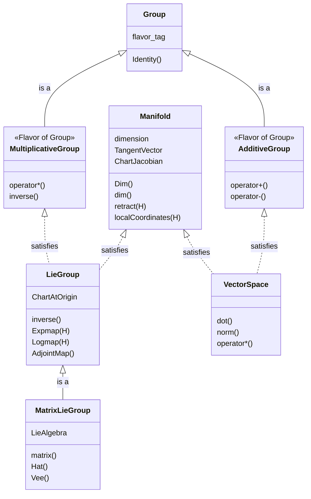

# GTSAM Concepts GTSAM概念

GTSAM建立在泛型编程(generic programming)的基础之上，使用C++概念(concept)来定义优化和建模中使用的类型的要求。"概念"是一组类型必须满足才能用于GTSAM泛型算法的要求。这些要求可以包括关联类型、特定方法和数学不变量。

本文档提供GTSAM中最重要的概念的高层次概述。有关如何实现满足这些概念的自定义类的详细说明，请参阅`gtsam/base/doc/`目录中的具体指南。

GTSAM使用两种主要机制将用户定义的类型连接到其框架：
1.  **基于特征(traits)的元编程**：不需要传统的继承，您为您的类特化`gtsam::traits`结构体。此特化告诉GTSAM关于您类型的特性和能力。
2.  **概念检查宏(Concept Checking Macros)**：GTSAM提供编译时宏（例如`GTSAM_CONCEPT_MANIFOLD_INST`），验证您的类是否正确实现了概念的所有要求。

---

## Testable 可测试

GTSAM中几乎每个概念都需要`Testable`概念作为前提条件。这提供了单元测试的通用接口。要成为`Testable`，一个类必须提供两个方法：
*   `print(const std::string& s)`：用于显示对象的值。
*   `equals(const T& other, double tol)`：用于在容差范围内比较两个对象是否相等。

每个概念的详细指南都进一步解释了此要求。

## Manifold 流形

[可微流形(differentiable manifold)](https://en.wikipedia.org/wiki/Differentiable_manifold)是一个非线性空间，可以在任意点处被一个称为切空间(tangent space)的向量空间局部近似。这是GTSAM中非线性优化的最基本概念。

流形的核心操作是：
*   `retract`：推广向量加法。它将一个向量从某点处的切空间映射回流形上。
*   `localCoordinates`：推广向量减法。它计算连接流形上两个点的切向量。

这些操作必须互为逆操作：`p.retract(p.localCoordinates(q))`应等于`q`。

有关创建新的`Manifold`类型的详细指南，请参见[Manifold](../gtsam/base/doc/Manifold.md)。

## Group 群

[群(group)](https://en.wikipedia.org/wiki/Group_(mathematics))是一个代数结构，具有满足结合律的复合(composition)操作，有单位元(identity element)，并且每个元素都有逆元(inverse)。

关键操作是`compose`、`inverse`和`between`。GTSAM根据其复合运算符区分两种"风格"的群：
*   **乘法群(Multiplicative Groups)**：使用`operator*`（例如旋转、位姿）。
*   **加法群(Additive Groups)**：使用`operator+`（例如向量）。

有关创建`Group`类型的详细指南，请参见[Group](../gtsam/base/doc/Group.md)。

## Lie Group 李群

[李群(Lie group)](https://en.wikipedia.org/wiki/Lie_group)是一个既是`Group`也是`Manifold`的空间，额外要求群操作是平滑的。这是在机器人和计算机视觉中表示位姿和旋转的核心概念。

李群有一个特殊的单位元，这允许定义全局的`Expmap`和`Logmap`操作，在流形和其在单位元处的切空间之间进行映射。在GTSAM中，实现`LieGroup`通常通过继承奇异递归模板模式(CRTP, Curiously Recurring Template Pattern)基类来简化，该基类免费提供许多方法。

GTSAM中的大多数李群也是**矩阵李群(Matrix Lie Group)**，具有底层的矩阵表示。这些需要额外的李代数(Lie algebra)操作，如`Hat`和`Vee`。

*   有关创建`LieGroup`的指南，请参见[LieGroup](../gtsam/base/doc/LieGroup.md)。
*   对于矩阵李群，另请参见[MatrixLieGroup](../gtsam/base/doc/MatrixLieGroup.md)。

## Vector Space 向量空间

`VectorSpace`是一个特化的`AdditiveGroup`，还支持标量乘法、点积和范数计算。此概念应由行为类似数学向量的类型满足。在GTSAM中，向量空间是流形上切空间的基础。

有关详细指南，请参见[VectorSpace](../gtsam/base/doc/VectorSpace.md)。

## 概述

下面的Mermaid图总结了不同几何概念之间的关系：

---

## 未来概念

以下概念描述了更高级的使用模式，例如群对流形的作用。

### Group Action 群作用

群作用本身也是概念。特别地，一个群可以*作用*于另一个空间。我们通过以下概念扩展来形式化：

*   有效表达式：
    *   `q = traits<T>::Act(g,p)`，对于空间*S*的某个实例*p*，该空间可以被群元素*g*作用以产生*S*中的*q*。
    *   `q = traits<T>::Act(g,p,Hp)`，如果被作用的空间是一个连续可微流形。

### Lie Group Action 李群作用

当李群作用在一个空间上时，我们需要关心两个导数：

  *   `gtsam::manifold::traits<T>::act(g,p,Hg,Hp)`，如果被作用的空间是一个连续可微流形。

一个例子是3D中的*相似变换(similarity transform)*，它可以作用于3D空间。关于`p`的导数`Hp`依赖于群元素`g`。关于`g`的导数`Hg`通常更复杂。
