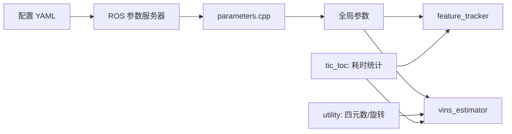

# 01 基础数据结构与工具

## 1. 参数：让 YAML 驱动算法

先读 `feature_tracker/src/parameters.{h,cpp}`，再读 `vins_estimator/src/parameters.{h,cpp}`。两者的模式相同：`readParameters()` 从 ROS 参数服务器取得配置文件路径，用 OpenCV `FileStorage` 读 YAML，写入头文件声明的全局变量。

前端重点是 `ROW/COL`、`FREQ`、`MAX_CNT`、`MIN_DIST`、`F_THRESHOLD`、`EQUALIZE`、`FISHEYE` 与相机标定文件。它们分别决定图像大小、发布频率、特征预算、特征均匀性、RANSAC 阈值和预处理。后端重点是 `WINDOW_SIZE`、IMU 噪声 `ACC_N/GYR_N/ACC_W/GYR_W`、`TD`、`ESTIMATE_TD`、`TIC/RIC`、`NUM_ITERATIONS/SOLVER_TIME`。

意义：这些不是普通“常量”。例如 `MAX_CNT` 增大使视觉约束更多但前端和优化更慢；错误的噪声会使 IMU 因子权重失真；错误的外参会让视觉和惯性永远无法对齐。

## 2. 最小工具

`tic_toc.h` 用 `std::chrono` 记录开始时间并由 `toc()` 返回毫秒，遍布实时路径，用于找出超时环节。

`utility/utility.{h,cpp}` 是数学胶水：`skewSymmetric(v)` 生成 `[v]_x`（满足 `[v]_x w=v×w`）；`deltaQ(θ)` 将小旋转向量转为增量四元数；`R2ypr/ypr2R` 负责 yaw-pitch-roll；`g2R(g)` 将估计重力对齐到世界竖直方向。四元数避免欧拉角万向锁，但 Ceres 中仍需局部 3 维扰动。

## 3. 相机模型的输入和输出

`camera_model` 的共同接口是“像素 ↔ 光线”。前端调用 `Camera::liftProjective(u,v)`：把有畸变像素反投影成相机光线 `p=(X,Y,Z)`，随后存归一化观测 `(x,y,1)=(X/Z,Y/Z,1)`。这使针孔、鱼眼、Cata、Scaramuzza 等模型在后端看来都是同一种“方向观测”。

读代码时不要把像素 `(u,v)` 和归一化坐标 `(x,y)` 混用：前者适合图像处理和 BRIEF，后者才进入几何残差。
