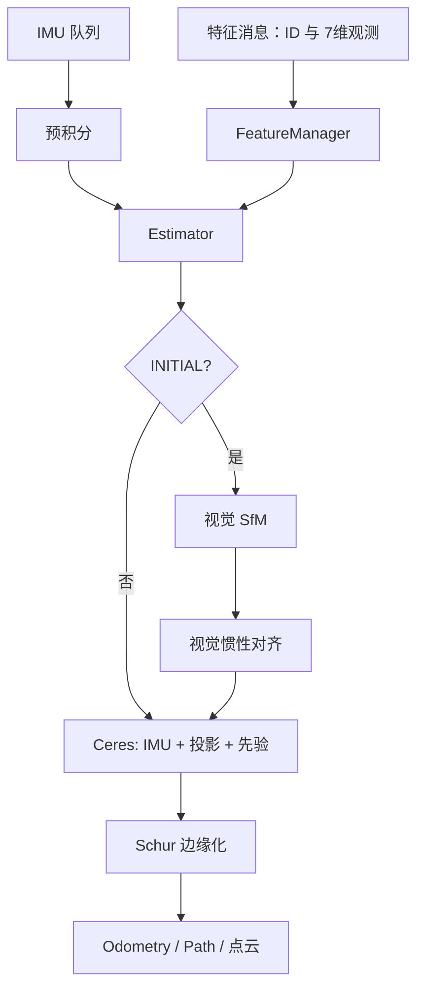

# 03 后端核心：固定窗口 VIO 如何估计状态

本章按运行时顺序展开；不要跳读 `Estimator::processImage()`，它是所有模块的汇合点。

## 运行时的精确调用链

$$
\text{IMU callback}\to\texttt{processIMU}
\quad\text{和}\quad
\text{feature callback}\to\texttt{processImage}
\to\begin{cases}
\texttt{initialStructure},&\texttt{INITIAL}\\
\texttt{solveOdometry}\to\texttt{optimization}\to\texttt{slideWindow},&\texttt{NON\_LINEAR}
\end{cases}
$$

### IMU 到预积分到初值

每个 IMU 输入是 $(\Delta t,a_m,\omega_m)$。`processIMU` 先把原始测量同时写入 `pre_integrations[frame_count]`、`tmp_pre_integration` 和三个 buffer；前者用于窗口优化，后两者用于初始化/滑窗重组。随后只为下一次优化给出传播初值：

$$
\begin{aligned}
a_W&=R(a_m-b_a)-g,\\
R^+&=R\operatorname{Exp}((\omega_m-b_g)\Delta t),\\
P^+&=P+V\Delta t+\tfrac12a_W\Delta t^2,\\
V^+&=V+a_W\Delta t.
\end{aligned}
$$

注意：源码在积分内取前后两条测量的中值；上式只是传播骨架，最终残差由 `IntegrationBase` 的 $\Delta p,\Delta q,\Delta v$ 与协方差决定。

### 一张特征帧进入后，变量如何变化

|顺序|函数/成员|写入什么|后果|
|---|---|---|---|
|1|`addFeatureCheckParallax`|每个 ID 新增 `FeaturePerFrame([x,y,1,u,v,v_x,v_y])`|同一 ID 的多帧观测连成一条轨迹|
|2|`Headers[frame_count]`|当前 ROS 时间戳|窗口状态与 IMU 积分的时间锚点|
|3|`all_image_frame[t]`|特征 map + `tmp_pre_integration` 指针|初始化可重建整段视觉-IMU历史|
|4|新建 `tmp_pre_integration`|从当前图像时刻重新积|供下一帧交接|
|5|初始化或优化|更新 `Ps,Rs,Vs,Bas,Bgs` 与深度|得到当前米制状态|
|6|`slideWindow`|移动数组，删除/合并观测，产生先验|窗口长度恒定|

### 视觉因子：五次坐标变换，不能省任何一次

锚帧观测 $p_i=[x_i,y_i,1]^T$ 与逆深度 $\rho$ 先恢复 $P_{C_i}=p_i/\rho$。源码随后逐次计算：

$$
\begin{aligned}
P_{I_i}&=R_{IC}P_{C_i}+t_{IC},\\
P_W&=R_{WI_i}P_{I_i}+P_{WI_i},\\
P_{I_j}&=R_{WI_j}^T(P_W-P_{WI_j}),\\
P_{C_j}&=R_{IC}^T(P_{I_j}-t_{IC}),\\
r_C&=\sqrt\Lambda\left(\begin{bmatrix}X_j/Z_j\\Y_j/Z_j\end{bmatrix}-\begin{bmatrix}x_j\\y_j\end{bmatrix}\right).
\end{aligned}
$$

对投影 $\pi(X,Y,Z)=(X/Z,Y/Z)$ 的导数来自商法则：

$$
\frac{\partial\pi}{\partial P_C}=
\begin{bmatrix}1/Z&0&-X/Z^2\\0&1/Z&-Y/Z^2\end{bmatrix}.
$$

这正是 `projection_factor.cpp` 的 `reduce` 矩阵；小旋转导数 $\partial(Rp)/\partial\delta\theta=-R[p]_\times$ 解释了后面的 `skewSymmetric`。

### 初始化：为何先 SfM 后 IMU

`initialStructure` 先由匹配点五点法得到相对 $R,t$，`GlobalSFM` 用三角化、PnP、BA 补全所有帧。此时所有平移只差未知尺度 $s$。`VisualIMUAlignment` 以视觉位姿和 IMU 预积分联合求 $s$、重力 $g$、速度和陀螺 bias；随后缩放位置/深度、重积分并把 $g$ 旋到世界系。没有这一步，单目轨迹不可能变成米制轨迹。

### 优化与边缘化：从因子到先验

`optimization` 加入 IMU 因子、每条跨帧轨迹的投影因子、外参/时间偏移和上一轮先验，最小化：

$$
\min_x\sum\|r_{\mathrm{imu}}\|^2+\sum\rho\!\left(\|r_{\mathrm{cam}}\|^2\right)+\|r_{\mathrm{prior}}\|^2.
$$

边缘化把待删变量 $x_m$ 和保留变量 $x_r$ 的正规方程分块，并消掉 $x_m$：

$$
H' = H_{rr}-H_{rm}H_{mm}^{-1}H_{mr},\qquad
b' = b_r-H_{rm}H_{mm}^{-1}b_m.
$$

源码将 $H'$ 分解成 $J_{lin}^TJ_{lin}$，保存成下一轮的 $r_{prior}=r_{lin}+J_{lin}(x_r-x_{r0})$。所以删的是变量，不是它携带的信息。

## 1. 两路输入在节点中汇合

`estimator_node.cpp` 分别缓存 IMU 和 `/feature`。处理一张特征帧时，取出其时间戳之前的 IMU；边界处对最后一段测量插值，确保积分恰好落在相机时刻；依次调用 `Estimator::processIMU(dt,a,w)`，最后调用 `processImage(image,header)`。这一步的意义是：视觉帧低频但精确，IMU 高频但漂移，必须严格时间对齐才可互相约束。

## 2. 状态和特征管理

窗口通常有 `WINDOW_SIZE+1=11` 个时刻。每时刻状态是

`x_i={P_i(3), Q_i(4), V_i(3), b^a_i(3), b^g_i(3)}`。

`FeatureManager` 将 ID 聚合为 `FeaturePerId`，其中的 `FeaturePerFrame` 保存前端 7 维观测。`addFeatureCheckParallax()` 添入本帧观测并用平均视差决定它是否是关键帧：视差太小则边缘化倒数第二帧，足够大则边缘化最老帧。`triangulate()` 对多帧射线求深度；优化实际使用逆深度 `ρ=1/z`，它比直接优化深度更稳定。

## 3. IMU 预积分与 IMU 因子

`IntegrationBase::push_back()` 累积两张图像间的 IMU，并缓存原始数据。中值积分使用两端测量：

`R_{k+1}=R_k Exp((ω-b_g)Δt)`

`v_{k+1}=v_k+(R(a-b_a)-g)Δt`，`p_{k+1}=p_k+v_kΔt+½(R(a-b_a)-g)Δt²`。

它同时传播雅可比与协方差 `P←F P Fᵀ+V Q Vᵀ`。`IMUFactor` 把预积分增量与相邻两帧的 `P,Q,V,b_a,b_g` 比较，形成 15 维残差（位置、旋转、速度、两种 bias），并以协方差逆平方根白化。bias 改变后，可由一阶雅可比校正；初始化时也可 `repropagate` 重积分。

## 4. 视觉因子、局部参数化与优化

`ProjectionFactor` 从锚帧射线和逆深度恢复 3D 点，经过相机—IMU 外参和两帧位姿变换，投到目标帧并与观测比较，形成 2 维重投影残差 `r=z_hat-z_obs`。`ProjectionTdFactor` 额外用 `z(td)=z+v(td-td_obs)` 校正时间偏移。`PoseLocalParameterization` 用 6 维增量更新 7 维 `[p,q]`：`p'=p+δp, q'=q⊗δq(δθ)`。

`Estimator::optimization()` 组装：上轮边缘化先验 + 各相邻帧 IMU 因子 + 每条跨帧特征的视觉因子 + 可选外参/TD，再用 Ceres `DENSE_SCHUR`、Cauchy 核和 Dogleg 求解。求解后 `double2vector()` 写回状态，剔除外点。

## 5. 初始化和边缘化

初始阶段窗口满后：`relativePose()` 从足够视差的匹配求相对位姿；`GlobalSFM::construct()` 三角化、PnP 补全各帧纯视觉结构；`VisualIMUAlignment()` 联立预积分和视觉运动，求陀螺 bias、尺度、速度、重力，再把重力对齐世界坐标。成功后才进入非线性 VIO。

窗口不能无限长。`MarginalizationInfo` 对即将删除状态的关联 IMU/视觉因子线性化为正规方程，并消元：

`H' = H_rr-H_rm H_mm^{-1}H_mr`，`b'=b_r-H_rm H_mm^{-1}b_m`。

它将 `(H',b')` 分解成一个新的线性先验 `residual=r_lin+J_lin(x-x0)`。因此旧帧被删，信息却留给以后；这是实时系统能固定复杂度的关键。

## 6. 输出

非线性阶段每帧输出当前 IMU 位姿/速度的 `nav_msgs/Odometry`、路径、窗口关键位姿、重建点云和相机位姿可视化；若 `failureDetection()` 发现 bias、速度、位置或姿态异常则清空状态并重启。
