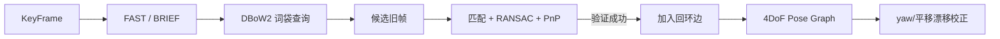

# 04 回环检测与全局优化

## 输入与关键帧

`pose_graph_node.cpp` 同步接收图像、局部 VIO 位姿、点云/特征和关键帧信息，形成 `KeyFrame`。它保存时间、局部 VIO 位姿、归一化点、像素点、特征 ID 和图像；构造时对窗口内 VIO 特征及 FAST 角点计算 BRIEF 描述子。前者用于几何验证，后者用于地点检索。

## 逐步数据变化

|阶段|输入|处理|生成的数据|为什么需要|
|---|---|---|---|---|
|关键帧构造|图像、VIO pose、VIO 点|窗口点与 FAST 点分别算 BRIEF|两套描述子|“可检索”和“可做几何验证”是不同需求|
|候选检索|整图 BRIEF|DBoW2 词袋查询，排除临近帧|历史候选 index|快速从大量帧中找外观相似地点|
|连接验证|候选、窗口点、ID|汉明匹配→RANSAC→PnP|相对位姿 `loop_info` 和内点|拒绝相似纹理造成的伪回环|
|入图|局部边 + 回环边|加入 `keyframelist/optimize_buf`|待优化的关键帧图|把局部漂移转成全局约束|
|后台优化|所有边|4DoF Ceres 优化|`yaw_drift,t_drift,r_drift`|校正历史路径和后续 VIO|

### 4DoF 残差的含义

IMU 已约束重力，所以优化变量只有 $x_i=[\psi_i,t_i]$：yaw 加三维平移，pitch/roll 固定。对一条 $i\to j$ 边，预测相对平移为

$$
\hat t_{ij}=R(\psi_i,\mathrm{pitch}_i,\mathrm{roll}_i)^T(t_j-t_i),
$$

残差是 $[\hat t_{ij}-t_{ij}^{obs},\;\mathrm{wrap}(\psi_j-\psi_i-\psi_{ij}^{obs})]$。回环边跨越很长时间，能把累积 yaw/平移漂移拉回一致；它不直接替换局部滑窗的实时估计。

## 回环的四步

1. `PoseGraph::detectLoop()` 将新关键帧 BRIEF 的 BoW 向量查询 DBoW2 词袋数据库，排除时间上太近的帧，返回候选旧帧；没有候选则将新帧入库。
2. `KeyFrame::findConnection(old_kf)` 对描述子做汉明距离匹配，借助相机模型转为归一化点，再用几何 RANSAC/PnP 过滤错误匹配。
3. 验证成功得到旧帧到当前帧的相对平移/旋转 `loop_info`，写入回环边；同时计算当前局部 VIO 坐标应移到全局坐标的 `shift_yaw/shift_r/shift_t`。
4. 将关键帧索引放入优化队列，后台 `optimize4DoF()` 优化。

## 为什么是 4DoF

VIO 已由 IMU 观测重力，roll 与 pitch 可靠；图优化只优化每帧平移 `(x,y,z)` 和绕重力的 yaw。相邻帧的 VIO 相对位姿形成顺序边，回环匹配形成长边。`FourDOFError` 计算“由两端全局变量推得的相对运动”和观测相对运动的差。优化后得到 yaw 漂移与平移漂移，并更新关键帧姿态、轨迹和后续 VIO 的漂移校正。

输出是校正后的 PoseGraph 路径、各序列路径、点/边可视化和（配置允许时）结果文件。它不替代局部 VIO：局部窗口负责实时、回环图负责长期一致性。
