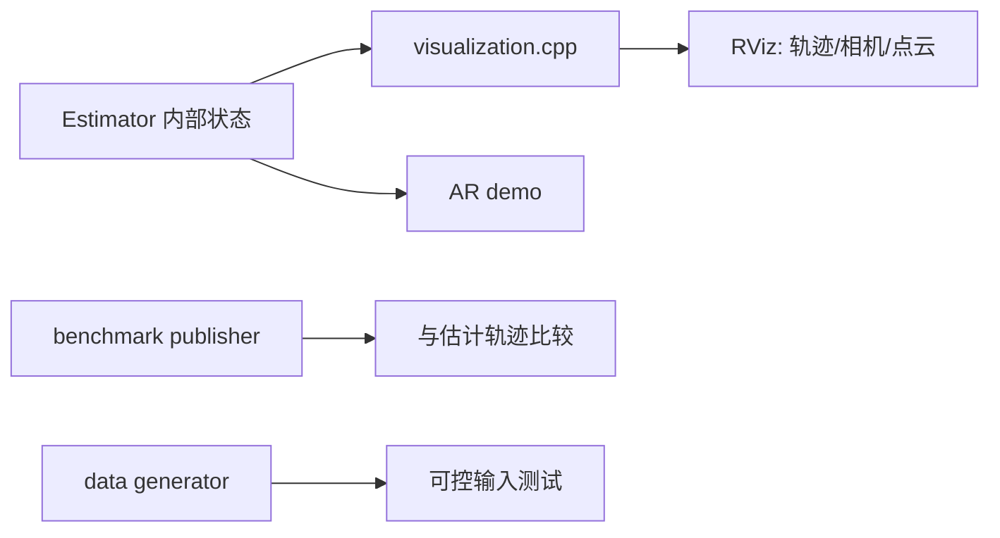

# 05 辅助模块与阅读实践

## 可视化与辅助节点

`vins_estimator/src/utility/visualization.{h,cpp}` 把估计器内部的位姿、窗口关键帧、特征点、相机轨迹转换成 ROS 消息；它是验证“状态是否合理”的最好入口，而不是算法主干。`pose_graph/src/utility` 有同类相机位姿/边可视化工具。

`ar_demo_node.cpp` 将图像与 VIO 位姿配对，再把虚拟物体投影到图像，展示估计结果能否稳定支持增强现实。`benchmark_publisher_node.cpp` 发布数据集真值/基准消息；`data_generator.cpp` 产生可控的仿真传感器数据。三者都不改变 VIO 主算法。

## 建议的实战阅读法

1. 启动一次数据集，依次观察 `/feature`、`/vins_estimator/odometry`、路径和 pose graph 路径。先把消息内容与本文输入输出对上。
2. 在 `img_callback → readImage → publish` 断点，记录同一 `feature_id` 的像素、归一化坐标、速度。
3. 跟到 `estimator_node` 的时间同步，再跟 `processIMU → processImage → optimization`；每次只看一个 ID 和一对图像帧，避免被容器淹没。
4. 最后看 `addKeyFrame → detectLoop → findConnection → optimize4DoF`。若无回环，检查词袋候选；若候选被拒，检查描述子匹配和几何 RANSAC。

## 常见误解

- “单目直接输出米制轨迹”：不对；纯视觉只到相似变换，米制尺度在视觉—惯性对齐后得到。
- “边缘化等于删除信息”：不对；删除变量，保留其对剩余变量的 Schur 先验。
- “回环直接改优化窗口”：不对；本实现主要用局部 VIO 保实时，再由 pose graph 做全局漂移校正。
- “特征深度就是 3D 点”：深度是锚帧射线上的一个标量；射线加深度、位姿和外参才确定世界 3D 坐标。
