## 模块目标

把 OpenClaw 的"智能体核心引擎"先看成一个整体，再进入各子模块细拆。

openclaw采用 `harness` 架构

> **Harness 架构的本质是"分层决策"：Router 定方向，Selector 选资源，Assembler 控信息，LLM 只负责最后的推理。LLM 不知道全局，只知道 Harness 让它知道的——这就是"变薄"的含义**

---

## Agent 执行链路

[[openclaw-architecture.excalidraw]]

```mermaid
flowchart TD
    %% ============================================================
    %% 色彩系统：低饱和莫兰迪风格，文字统一白色确保可读性
    %% ============================================================
    classDef entry       fill:#2563eb,stroke:#1d4ed8,stroke-width:2px,color:#fff
    classDef orchestration fill:#7c3aed,stroke:#6d28d9,stroke-width:2px,color:#fff
    classDef queue       fill:#d97706,stroke:#b45309,stroke-width:2px,color:#fff
    classDef attempt     fill:#0891b2,stroke:#0e7490,stroke-width:2px,color:#fff
    classDef prep        fill:#059669,stroke:#047857,stroke-width:2px,color:#fff
    classDef llm         fill:#ea580c,stroke:#c2410c,stroke-width:2px,color:#fff
    classDef stream      fill:#db2777,stroke:#be185d,stroke-width:2px,color:#fff
    classDef recovery    fill:#6366f1,stroke:#4f46e5,stroke-width:2px,color:#fff
    classDef success     fill:#16a34a,stroke:#15803d,stroke-width:2px,color:#fff
    classDef terminal    fill:#dc2626,stroke:#b91c1c,stroke-width:2px,color:#fff
    classDef lifecycle   fill:#0d9488,stroke:#0f766e,stroke-width:2px,color:#fff
    classDef decision    fill:#fbbf24,stroke:#d97706,stroke-width:3px,color:#1f2937

    %% ============================================================
    %% 入口编排层
    %% ============================================================
    A1["chat.send (CLI)"]:::entry
    A2["auto-reply"]:::entry
    A1 --> C["AcpSessionManager.runTurn()<br/>状态机: idle→running"]:::orchestration
    A2 --> B["runAgentTurnWithFallback()<br/>外层模型降级循环"]:::orchestration
    B -->|"候选模型耗尽"| Z["FallbackSummaryError<br/>返回失败"]:::terminal
    B --> C

    %% ============================================================
    %% ACP + Lane 队列层
    %% ============================================================
    C --> D["withSessionActorQueue<br/>session:${key} Lane 序列化"]:::queue

    %% ============================================================
    %% Runner 核心循环层
    %% ============================================================
    D --> F["runEmbeddedPiAgent()<br/>while(true) 主循环 | MAX_RUN_LOOP_ITERATIONS"]:::orchestration
    F -.-> E["consumeAcpTurnStream()<br/>消费事件流 text_delta/tool_call/done/error"]:::orchestration
    F --> G1["enqueueSession()<br/>session:${key} Lane"]:::queue
    G1 --> G2["enqueueGlobal()<br/>CommandLane.Main / CronNested"]:::queue
    G2 --> H["resolveModel() + resolveAuthProfiles()<br/>模型 + API Key 候选链"]:::orchestration
    H -->|"所有 profile cooldown"| H

    %% ============================================================
    %% Attempt 单次尝试层 — 准备阶段（严格顺序）
    %% ============================================================
    H --> I["runEmbeddedAttempt()<br/>单次尝试生命周期"]:::attempt

    subgraph AttemptPrep ["📦 Attempt 准备阶段"]
        direction TB
        I1["loadWorkspaceSkillEntries<br/>技能加载 + 环境注入"]:::prep
        I2["resolveSandboxContext<br/>Sandbox 解析 + Workspace 确定"]:::prep
        I3["createOpenClawCodingTools()<br/>基础工具 + Bundle MCP/LSP 叠加"]:::prep
        I4["buildAttemptSystemPrompt()<br/>System Prompt 组装"]:::prep
        I5["SessionManager.open()<br/>加载/修复历史会话"]:::prep
        I6["sanitizeSessionHistory()<br/>清洗 + heartbeat过滤 + limit"]:::prep
        I7["ContextEngine.assemble()<br/>上下文组装（如有 memory 插件）"]:::prep
        I8["before_agent_run Hook<br/>插件拦截检查"]:::prep
        I1 --> I2 --> I3 --> I4 --> I5 --> I6 --> I7 --> I8
    end
    I --> AttemptPrep

    %% ============================================================
    %% 预提交检查 — 上下文溢出预防
    %% ============================================================
    I8 --> I9{"preemptiveCompaction<br/>预提交溢出检查?"}:::decision
    I9 -->|"是"| I10["truncateToolResults /<br/>compactSession 压缩"]:::recovery
    I9 -->|"否"| StreamPipeline
    I10 -->|"重试外层 loop"| F

    %% ============================================================
    %% StreamFn 处理管道（prompt 调用前组装）
    %% ============================================================
    J["activeSession.prompt()<br/>LLM 流式调用"]:::llm

    subgraph StreamPipeline ["🔧 StreamFn 处理管道"]
        direction TB
        S1["基础 stream<br/>resolveEmbeddedAgentStreamFn"]:::stream
        S2["Provider Text Transforms"]:::stream
        S3["Tool Call 规范化<br/>trim / repair malformed args / decode HTML"]:::stream
        S4["Tool Call ID 消毒<br/>兼容 Mistral / OpenAI Responses"]:::stream
        S5["Idle Timeout 检测<br/>streamWithIdleTimeout"]:::stream
        S6["Diagnostic Model Call Events"]:::stream
        S7["Cache Trace / Anthropic Payload Log"]:::stream
        S1 --> S2 --> S3 --> S4 --> S5 --> S6 --> S7
    end
    StreamPipeline --> J

    %% ============================================================
    %% 事件订阅 + 输出处理
    %% ============================================================
    J --> K["subscribeEmbeddedPiSession<br/>事件订阅处理"]:::stream
    K -->|"text_delta"| K1["onPartialReply / onBlockReply<br/>流式输出到通道"]:::success
    K -->|"tool_call"| K2["工具执行 + 结果回传<br/>触发 agent 内部下一轮 loop"]:::success
    K -->|"compaction_event"| K3["等待 compaction retry<br/>aggregate timeout 60s"]:::recovery

    %% ============================================================
    %% Attempt 结果判断与恢复链路
    %% ============================================================
    K --> L{"Attempt 结果判断"}:::decision

    L -->|"✅ 成功"| M["buildRunPayloads<br/>拼装回复 → 发回通道"]:::success
    L -->|"⏱️ timeoutDuringCompaction"| N1["使用 preCompactionSnapshot<br/>保证状态一致性"]:::recovery
    L -->|"📦 contextOverflow (mid-turn precheck)"| N2["truncateToolResults /<br/>compactSession 压缩"]:::recovery
    L -->|"❌ promptError (rate-limit / auth / overload)"| O["记录失败 → 外层循环<br/>auth profile 轮换 / 模型降级"]:::recovery
    L -->|"🧠 thinkingUnsupported"| P["pickFallbackThinkingLevel<br/>降级思考层级"]:::recovery
    L -->|"🚫 用户中断 / Abort"| Q["清理资源 + 释放 session lock"]:::terminal

    %% 恢复回路的正确指向
    N1 -->|"重试"| F
    N2 -->|"重试"| F
    O -->|"同模型重试"| F
    O -->|"切换模型"| B
    P -->|"重试"| F

    M --> R["runAgentCleanupStep<br/>flush trajectory / release lock"]:::success

    %% ============================================================
    %% 子 Agent 生命周期（旁路系统）
    %% ============================================================
    subgraph SubagentLifecycle ["🧬 子 Agent 生命周期"]
        direction TB
        T1["sessions_spawn 工具调用"]:::entry
        T2["subagent-registry.registerSubagentRun<br/>注册运行记录"]:::lifecycle
        T3["Lifecycle Events<br/>start / end / error / yielded"]:::lifecycle
        T4["Sweeper 60s 扫描<br/>Orphan 恢复 + TTL 清理"]:::recovery
        T5["sessions_yield<br/>暂停等待父会话唤醒"]:::lifecycle

        T1 --> T2 --> T3 --> T4
        T3 -->|"yielded=true"| T5
        T5 -->|"resume"| T2
    end
```




**图例说明**

| 颜色    | 含义      | 对应节点                                                                  |
| ----- | ------- | --------------------------------------------------------------------- |
| 🔵 蓝色 | 入口/触发   | `chat.send (CLI)`, `auto-reply`, `sessions_spawn`                                         |
| 🟣 紫色 | 编排控制    | `runAgentTurnWithFallback`, `AcpSessionManager`, `runEmbeddedPiAgent` |
| 🟡 琥珀 | 队列/Lane | `session:${key}`, `global`, `enqueueSession`                          |
| 🔷 青色 | 单次尝试    | `runEmbeddedAttempt`                                                  |
| 🟢 翠绿 | 准备阶段    | skills, sandbox, tools, system prompt, session open                   |
| 🟠 橙色 | LLM 调用  | `activeSession.prompt()`                                              |
| 🩷 粉红 | 流处理     | `subscribeEmbeddedPiSession`, StreamFn 管道层                            |
| 🔵 靛蓝 | 恢复/降级   | compaction, fallback, auth rotation                                   |
| 🟢 绿色 | 成功输出    | build payloads, cleanup                                               |
| 🔴 红色 | 终止/失败   | abort, fallback exhausted                                             |
| 🦚 青绿 | 生命周期    | subagent registry, lifecycle events                                   |
| 💛 黄色 | 决策点     | 结果判断, overflow 检查                                                     |

**关键设计洞察**

1. **四层调用栈**：外层模型降级 → ACP 状态机 → Runner while 循环 → Attempt 单次尝试。错误恢复在不同层级处理。
2. **双层 Lane**：`session:${key}` 保证同会话串行，`global` 协调跨会话资源。
3. **StreamFn 管道**：7 层包装器从内到外依次处理 provider 转换、工具规范化、ID 消毒、空闲超时、诊断事件、缓存追踪。
4. **Compaction 状态一致性**：`timeoutDuringCompaction` 时使用 `preCompactionSnapshot`，避免压缩中途超时导致消息状态撕裂。
5. **子 Agent 旁路**：通过 `subagent-registry` 独立跟踪生命周期，与主执行链路解耦。

**源码文件 → 图中节点对照**

| 源码文件 | 对应图中节点 | 所属层级 |
|----------|-------------|----------|
| `src/commands/agent.ts` | `chat.send (CLI)` | 入口 |
| `src/auto-reply/reply/agent-runner-execution.ts` | `runAgentTurnWithFallback()` | 入口编排层 |
| `src/agents/pi-embedded.ts` | `runEmbeddedPiAgent()` 入口 | Runner 层 |
| `src/agents/pi-embedded-runner/run.ts` | `runEmbeddedPiAgent()` while 循环 | Runner 层 |
| `src/agents/pi-embedded-runner/run/attempt.ts` | `runEmbeddedAttempt()` | Attempt 层 |
| `src/agents/pi-tools.ts`, `openclaw-tools.ts` | `createOpenClawCodingTools()` | Attempt 准备阶段 (I3) |
| `src/agents/pi-embedded-subscribe.ts` | `subscribeEmbeddedPiSession` | 流处理层 |
| `src/agents/pi-embedded-runner/lanes.ts` | `enqueueSession()` / `enqueueGlobal()` | Runner 队列层 |
| `src/process/command-queue.ts` | `session:${key}` / `CommandLane.Main` | Runner 队列层 |
| `src/agents/tools/sessions-spawn-tool.ts` | `sessions_spawn 工具调用` | 子 Agent 旁路 |
| `src/agents/subagent-registry.ts` | `subagent-registry.registerSubagentRun` | 子 Agent 旁路 |
| `src/agents/skills.ts`, `skills/refresh.ts` | `loadWorkspaceSkillEntries` | Attempt 准备阶段 (I1) |
| `src/agents/model-fallback.ts` | `resolveModel() + resolveAuthProfiles()` | Runner 层 |

---

### 实现拆解

1. 上层入口:

- src/commands/agent.ts
- src/auto-reply/reply/agent-runner-execution.ts

2. 核心执行入口:

- src/agents/pi-embedded.ts
- src/agents/pi-embedded-runner.ts
- src/agents/pi-embedded-runner/run.ts

3. 核心子系统:

- 运行尝试: src/agents/pi-embedded-runner/run/attempt.ts
- 工具系统: src/agents/pi-tools.ts, src/agents/openclaw-tools.ts
- 流式事件: src/agents/pi-embedded-subscribe.ts
- 并发模型: src/agents/pi-embedded-runner/lanes.ts, src/process/command-queue.ts
- 子智能体: src/agents/tools/sessions-spawn-tool.ts, src/agents/subagent-registry.ts
- 技能系统: src/agents/skills.ts, src/agents/skills/refresh.ts
- 失败恢复: src/agents/model-fallback.ts, src/agents/pi-embedded-runner/run.ts

---

### 细粒度讲解

1. 这套框架的职责是"把一次用户请求跑完"

- 选模型与认证
- 组装 system prompt + skills + tools
- 流式执行并回传片段
- 处理错误、超时、压缩、回退

2. 这是"多层编排"而不是"一个大函数"

- 上层决定什么时候跑
- 中层决定怎么跑（队列、lane、session）
- 下层负责具体执行（PI session + 工具调用）

3. 它是"状态机 + 事件流"

- 生命周期事件: start/update/end/error
- tool 事件与 assistant 文本事件并行
- 最终由上层转成对外回复 payload

--- 

## runEmbeddedPiAgent 运行链路

**执行链路**

核心文件：`src/agents/pi-embedded-runner/run.ts`

> [!Tip] 返回结果不只是文本
> - 包含 payloads、usage、tool 元信息、错误标记
> - 上层再决定如何输出给用户/通道

---

### 1. 解析lane：

- `resolveSessionLane` 
- `resolveGlobalLane`

Session Lane 保证同一个 `session` 的所有运行串行， 防止同一 `session` 的多个消息并发执行导致 `transcript` 写入冲突、工具调用顺序混乱

Global Lane 控制全局并发数，防止同时向模型发起过多请求，避免 `rate limit`、内存耗尽

**设计原因**：

- 双层队列
	
	- 如果只用一个全局队列，不同 session 的消息会互相阻塞。A 用户的消息需要等 B 用户的模型调用完成才能开始。
	- 如果只按 session 队列，无法限制全局并发。100 个 session 同时发消息会同时发起 100 个模型请求。
	- 双层设计 = 每个 session 内部串行 + 全局并发可控

---

### 2. 双层入队:

先 session lane，再 global lane（`enqueueCommandInLane`）

先获取 Session Lane 的锁：确保同 session 的多个请求按顺序进入，再获取 Global Lane 的锁：控制全局并发

**设计原因**：

- 先后顺序
	- 如果先 Global 再 Session：两个同 session 的请求可能同时通过 global，然后在 session lane 排队。但它们已经占用了 2个全局并发槽，浪费了资源。
	- 当前设计确保：只有当请求真的准备执行（通过了两层队列）时才占用全局资源。

---

### 3. 执行准备：

#### `ensureOpenClawModelsJson` 

为 `PI harness` 生成/更新 models.json，包含可用模型列表

**`models.json`**
- PI Agent Core 需要知道每个模型的精确参数（max tokens、supports vision、supports function calling 等）  
- 这是静态配置 + 动态发现的混合：基础配置在代码里，用户自定义模型在配置文件里，运行时合并生成 models.json

#### `resolveModel` 

从 models.json 中解析具体模型的 API 配置 （context window、 pricing、 capabilities）

**resolveModel 两次运行**
1. 跳过 PI 发现，用插件动态模型 hook 解析模型
2. 判断插件动态模型 hook 成功解析了模型 或者 选中的harness是第三方插件，则不需要生成 PI 的 models.json；否则必须生成models.json，并重新解析

#### 上下文窗口检查 

计算实际可用的上下文窗口大小

- 不同 provider 对同一模型的 context window 定义可能不同（如是否包含 system prompt）
- Harness 可能有自己的上下文计算方式（Codex 的上下文管理不同于 PI）
- contextConfigProvider 处理这种差异，例如 Codex + OpenAI 时使用 openai-codex 配置

#### auth profile 选择/轮换

auth 状态机设计
```
初始状态 → initializeAuthProfile()
    │
	▼
尝试用 profileCandidates[0] 调用模型
      │
      ├── 成功 → 标记 profile 为 good，继续执行
      │
      └── 失败（auth 错误）→ maybeRefreshRuntimeAuthForAuthError()
                │
                ├── 能刷新 → 用新 token 重试
                │
                └── 不能刷新 → advanceAuthProfile() → 尝试下一个 profile
                          │
                          └── 所有 profile 耗尽 → 抛出 FailoverError
```

Auth Profile 轮换目的

- 用户可能配置了多个 API key（个人、工作、备用）
- 某些 key 可能临时失效（过期、配额用完、被撤销）
- 自动轮换提供容错能力，无需用户手动切换
- Profile 有 cooldown 机制，失败的 profile 会被暂时禁用，避免反复尝试

Profile 优先级：

  1. 用户显式指定的 (--auth-profile)
  2. Provider 推荐的 (providerOrderedProfiles)
  3. 默认顺序（按配置顺序）

### 4. 运行尝试 (runEmbeddedAttemptWithBackend) 

**单次模型调用的完整生命周期**

Prompt 构建：

- System prompt（基础 + skills + bootstrap context）
- 历史消息（从 session transcript 加载）
- 当前用户消息
- 图片/附件

工具列表准备：

- 根据配置过滤可用工具
- 应用工具策略（owner-only、group policy 等）
- 生成 JSON Schema 给模型

调用模型（通过 harness）：

- PI harness → pi-agent-core 的 runAgentTurn()
- Codex harness → Codex app-server
- 其他插件 harness → 插件自己的传输层
 
处理模型响应：

- 文本增量 → 流式输出
- Tool calls → 执行工具 → 结果回传 → 继续对话（多轮）
- Compaction 触发 → 压缩上下文

返回 Attempt Result：
  
``` typescript
  {
    assistantTexts: string[],      // 助手输出的文本片段
    toolMetas: Array<{toolName, meta}>,  // 工具执行元数据
    messagesSnapshot: AgentMessage[],    // 最终消息列表快照
    lastAssistant: { usage, stopReason, errorMessage },  // 最后助手消息
    compactionCount: number,       // 本 attempt 中的压缩次数
    aborted: boolean,
    timedOut: boolean,
    // ... 更多字段
  }
```

---

### 5. 失败处理

#### `Profile` 轮换

prompt 提交失败（auth 错误、rate limit、billing）时触发

为什么在同模型内轮换 profile？

- 同一 provider 的不同 key 可能有不同配额状态
- 比直接 fallback 到不同模型更快（不需要重新加载模型配置）
- 保留当前模型的能力和上下文

#### `Compaction`

两种 Compaction 触发场景

- Overflow Compaction：模型返回 context overflow，目的是减少上下文大小以适配模型窗口
- Timeout Compaction：模型超时 + prompt token 使用率 > 65%，目的是防止"大上下文+超时"的死循环

为什么 65% 阈值？

- 超时可能是由于上下文太大导致模型处理慢
- 65% 是经验值：prompt 占用了大部分窗口，输出空间不足，模型可能陷入困境
- 如果 prompt 很小但超时，可能是网络/模型问题，compaction 帮助不大

Compaction 后重试的注意事项：

- postCompactionGuard 防止 compaction 后陷入无限循环
- continueFromCurrentTranscript() 避免重复追加用户消息
- 如果 compaction 后仍然失败，会回退到 tool result truncation

#### Tool Result 截断

compaction 失败后，且检测到存在超大 tool result时触发

为什么需要截断？

- 某些工具（如 read 读取大文件、 web_fetch 抓取长网页）可能返回数万字符
- 这些结果占用了大量上下文窗口，但大部分内容对当前对话不重要
- 截断保留关键信息（如文件前几百行），丢弃冗余部分

#### Think Level 降级

模型返回"unsupported thinking level"错误时触发

为什么？

- 不是所有模型都支持所有 thinking lecel （如 Claude 的 extended thinking）
- 自动降级到模型支持的级别，避免用户手动调整

#### FailoverError 抛出

reason: "rate_limit" | "overloaded" | "auth" | "billing" | "model_not_found" | "timeout" |

为什么用结构化错误而不是普通 Error？

- 上游 model-fallback.ts 需要分类处理：不同 reason 有不同策略
- Session suspension 集成：某些错误（如 billing）可以触发 session 暂停，避免反复尝试
- 用户友好的错误消息：将技术错误转换为 actionable 的建议
- Metrics/observability：结构化数据便于日志分析和告警

Failover 决策树 (resolveRunFailoverDecision)：

  错误发生
  │
  ├── Prompt 阶段错误 ──┬── rate_limit ──→ rotate_profile (如果有更多 profile)
  │                    │                 └── 否则 fallback_model
  │                    ├── auth/billing ──→ rotate_profile
  │                    │                    └── 否则 fallback_model
  │                    ├── overloaded ──→ backoff + fallback_model
  │                    └── timeout ──→ rotate_profile / fallback_model
  │
  └── Assistant 阶段错误 ─┬── auth failure ──→ rotate_profile
						 ├── rate limit ──→ escalate to model fallback
						 ├── tool loop ──→ surface error

--- 

## 工具系统与策略管线

理解为什么模型不会“无限制调用所有工具”，而是通过策略管线受控执行。

### 执行链路

1. 工具集合构建:

- `src/agents/pi-tools.ts`
- `src/agents/openclaw-tools.ts`

2. 策略解析:

- `src/agents/pi-tools.policy.ts`
- `src/agents/tool-policy.ts`

3. 策略流水线应用:

- `src/agents/tool-policy-pipeline.ts`

4. 工具定义适配:

- `src/agents/pi-tool-definition-adapter.ts`

---

### 文件内容说明

#### 1. pi-tools.ts — 工具集的总装车间

这是整个工具系统的入口工厂。`createOpenClawCodingTools()` 不做任何权限判断，它的唯一职责是把所有可能用到的工具先组装出来。

**三类工具的来源：**

| 来源 | 获取方式 | 具体内容 |
|------|----------|----------|
| 基础 Coding Tools | `@mariozechner/pi-coding-agent` 的 `createCodingTools()` | read、write、edit（文件读写编辑） |
| Shell Tools | 懒加载 bash-tools.js | exec（执行命令）、process（后台进程管理） |
| OpenClaw 平台工具 | `createOpenClawTools()` | message（发消息）、sessions_spawn（spawn 子智能体）、web_search、browser、cron、nodes 等 20+ 个 |
| 插件工具 | `resolveOpenClawPluginToolsForOptions()` | 动态加载的第三方插件提供的工具 |
| Channel Tools | `listChannelAgentTools()` | 通道专属工具（如登录等） |

**特殊处理：**

- `read/write/edit`：如果有 sandbox，则替换为 sandbox 版本（`createSandboxedReadTool` 等），限制在容器内操作。
- `exec/process`：懒加载（`createLazyExecTool`），避免启动时就把 bash 相关模块全部载入。
- `apply_patch`：仅当 provider 是 OpenAI 且模型在允许列表中时才启用。
- memory flush 模式：只允许 read 和 write，且 write 被包装为追加-only，防止破坏已有数据。

#### 2. openclaw-tools.ts — OpenClaw 平台工具工厂

专门构造 OpenClaw 自有工具。每个工具都是一个符合 PI Agent Core 接口的对象（`name`、`description`、`parameters`、`execute`）。

创建的工具包括：

- **通信类**：`messageTool`、`heartbeatTool`、`ttsTool`
- **会话类**：`sessionsListTool`、`sessionsSpawnTool`、`sessionsYieldTool`、`sessionStatusTool`、`subagentsTool`
- **网络类**：`webSearchTool`、`webFetchTool`
- **媒体类**：`imageGenerateTool`、`videoGenerateTool`、`musicGenerateTool`、`imageTool`、`pdfTool`
- **系统类**：`cronTool`、`nodesTool`、`gatewayTool`、`agentsListTool`、`updatePlanTool`

所有工具默认都经过 `before_tool_call` hook 包装。

#### 3. pi-tools.policy.ts — 策略解析器

负责从 config 中解析出各层策略对象：

- `resolveEffectiveToolPolicy()` → 返回 `{ profilePolicy, globalPolicy, agentPolicy, ... }`
- `resolveGroupToolPolicy()` → 根据 `groupId`、`groupChannel`、`senderId` 等解析群组级策略
- `resolveSubagentToolPolicyForSession()` → 子智能体会话的 denylist 策略

**子智能体的硬编码限制（安全隔离）：**

```typescript
// 所有子智能体永远禁止
alwaysDenied = ["gateway", "agents_list", "session_status", "cron", "sessions_send"]
// 叶子子智能体（不可再 spawn）额外禁止
leafDenied = ["subagents", "sessions_list", "sessions_history", "sessions_spawn"]
```

#### 4. tool-policy.ts — 策略数据结构和基础操作

定义了策略的数据结构：

```typescript
type ToolPolicyLike = {
  allow?: string[];   // 白名单
  deny?: string[];    // 黑名单
};
```

**核心函数：**

- `applyOwnerOnlyToolPolicy()` — 处理 owner-only 工具（如 cron、gateway、nodes）。非 owner 调用时，要么从列表中移除，要么把 execute 替换为抛错函数。
- `buildPluginToolGroups()` / `expandPluginGroups()` — 处理插件工具的分组展开（如 `group:plugins` 展开为所有插件工具）。
- `analyzeAllowlistByToolType()` — 分析 allowlist 中是否有未知条目，用于告警提示。

#### 5. tool-policy-pipeline.ts — 策略流水线执行器

这是**"先构建，再过滤"**模式的核心执行部分。

```typescript
export function applyToolPolicyPipeline({
  tools,     // 已构建的完整工具列表
  toolMeta,  // 获取工具元数据（用于区分 core / plugin）
  warn,      // 告警回调
  steps,     // 策略步骤数组，按顺序执行
}): AnyAgentTool[]
```

`buildDefaultToolPolicyPipelineSteps()` 定义了默认的 7 层策略顺序：

1. `tools.profile` — 用户选中的 profile 策略
2. `tools.byProvider.profile` — provider 级 profile 策略
3. `tools.allow` — 全局策略
4. `tools.byProvider.allow` — 全局 provider 策略
5. `agents.<id>.tools.allow` — agent 级策略
6. `agents.<id>.tools.byProvider.allow` — agent provider 策略
7. `group tools.allow` — 群组策略

然后在外部调用处还会追加：

8. `sandbox tools.allow` — 沙箱策略
9. `subagent tools.allow` — 子智能体策略

每层策略通过 `filterToolsByPolicy()` 对工具列表做一次过滤。

#### 6. pi-tool-definition-adapter.ts — 工具定义适配器

负责把内部 `AgentTool` 格式转换为 PI Agent Core 所需的 `ToolDefinition` 格式。

**核心函数：**

- `toToolDefinitions(tools)` — 将每个工具包装为 `ToolDefinition`，关键是在 `execute` 中：
  1. 先执行 `runBeforeToolCallHook()`（如果工具还没被 hook 包装过）
  2. 调用真正的 `tool.execute()`
  3. catch 所有异常，转换为结构化的 error 结果（不会抛给上层）
- `toClientToolDefinitions(tools)` — 处理 OpenResponses 客户端工具，返回 pending 状态让客户端执行

---

### 设计原因和作用

#### 1. 为什么采用 "先构建，再过滤" 模式？

**核心思想：显式优于隐式。**

很多系统的做法是"根据当前上下文决定应该加载哪些工具"，这容易遗漏。OpenClaw 的做法是：

1. **构建阶段**：把所有理论上可用的工具都造出来（基础 coding + 平台 + 插件 + channel）
2. **过滤阶段**：用策略流水线一层层筛掉不该暴露的

**好处：**

- **安全审计友好**：任何时候都可以打印出"哪些工具被哪层策略过滤掉了"，便于排查
- **策略独立**：新增一层策略不需要改工具构建逻辑，只需要在 pipeline 里加一步
- **插件安全**：插件工具默认全部构建，但只有通过 allowlist 的才会真正暴露给模型
- **避免猜测**：不用去猜"这个场景应该有哪些工具"，而是"从全部工具里按规则排除"

#### 2. 策略层次为什么这样设计（从近到远）？

**策略优先级**：`profile > provider profile > global > global provider > agent > agent provider > group > sandbox > subagent`

**设计哲学：越具体的策略越优先。**

| 层级 | 作用 | 为什么在这个位置 |
|------|------|------------------|
| profile | 用户手动选择的工具 profile（如 "coding"、"minimal"） | 最优先，因为用户显式选择 |
| provider profile | 特定 provider 下的 profile 变体 | 次之，provider 特异性 |
| global | 全局 allow/deny | 基础默认值 |
| global provider | 特定 provider 的全局策略 | provider 特异性覆盖 |
| agent | 单个 agent 的配置 | agent 级覆盖 |
| agent provider | 特定 provider 下的 agent 策略 | 双重特异性 |
| group | 群组/频道级（如 Slack #general 禁止 exec） | 社交上下文限制 |
| sandbox | 沙箱运行时的工具限制 | 运行时环境隔离 |
| subagent | 子智能体的硬编码 denylist | 最后兜底，防止子智能体越权 |

**关键点**：每层都是 `allow + deny` 的组合。`deny` 是最终的否决权，即使在 `allow` 里也不能覆盖。

#### 3. 安全机制详解

**Owner-only 工具**

```typescript
const OWNER_ONLY_TOOL_APPROVAL_CLASS_FALLBACKS = new Map([
  ["cron", "control_plane"],      // 定时任务，影响系统运行
  ["gateway", "control_plane"],   // 网关控制，影响所有连接
  ["nodes", "exec_capable"],      // 节点管理，可能执行远程代码
]);
```

**为什么这样设计**：

- 这些工具的影响范围超出单个会话，可能危及整个网关
- 只有 `senderIsOwner === true` 的请求者才能使用
- 支持 `ownerOnlyToolAllowlist` 做运行时临时授权（如服务器下发的一次性许可），但不会把请求者变成 owner

**Workspace Root Guard**

所有文件操作工具（`read/write/edit`）都会被 `wrapToolWorkspaceRootGuard()` 包装。

**作用**：把路径解析限制在 workspace 根目录内，防止 `../../etc/passwd` 这类路径穿越。

**为什么不在工具内部做？** 因为工具来自多个来源（pi-coding-agent、OpenClaw 自有、插件），统一在外层包装比让每个工具自己实现更可靠。

**apply_patch 的模型限制**

```typescript
const applyPatchEnabled =
  applyPatchConfig?.enabled !== false &&
  isOpenAIProvider(options?.modelProvider) &&   // 仅限 OpenAI
  isApplyPatchAllowedForModel({...});            // 且模型在允许列表
```

**原因**：`apply_patch` 是 OpenAI 特有的原生工具格式，其他 provider 不支持。如果暴露给不支持的模型，会导致 API 调用失败。

**Subagent 的硬编码 Denylist**

子智能体不能操作 `gateway`、`cron`、`sessions_send` 等，因为：

- 子智能体是被 spawn 出来的，其身份是"访客"
- 如果子智能体能操作 cron，就能给自己创建永久定时任务
- 如果子智能体能操作 gateway，就能断开主智能体的连接
- `sessions_send` 被禁是为了防止子智能体冒充主智能体发消息

#### 4. Hook 系统（before_tool_call）

`before_tool_call` 是一个统一的拦截点，在工具实际执行前运行。

在 `pi-tools.before-tool-call.ts` 中，`runBeforeToolCallHook()` 按顺序执行：

1. **工具循环检测**（`detectToolCallLoop`）：检测同一工具+相同参数被反复调用，防止死循环
2. **Trusted Policy**（`runTrustedToolPolicies`）：插件注册的可信策略，可 block 或要求审批
3. **Plugin Hook**（`hookRunner.runBeforeToolCall`）：插件自定义的 `before_tool_call` hook

**三种拦截结果：**

- `blocked: true, kind: "veto"` → 返回结构化 blocked 结果给模型（模型能看到"被拒绝了"）
- `blocked: true, kind: "failure"` → 抛错（进入 adapter 的 catch，转为 error 结果）
- `requireApproval` → 弹审批请求给用户（通过 `callGatewayTool("plugin.approval.request")`）

**为什么需要 hook 系统而不是直接在策略层处理？**

- 策略层是静态的（配置决定 allow/deny）
- Hook 是动态的（可以基于运行时状态判断，如循环检测、参数校验、用户审批）
- Hook 可以修改参数（如把相对路径解析为绝对路径）

#### 5. 错误处理：为什么工具错误不会炸进程？

在 `pi-tool-definition-adapter.ts` 的 `toToolDefinitions()` 中：

```typescript
execute: async (...) => {
  try {
    const rawResult = await tool.execute(...);
    return normalizeToolExecutionResult(...);
  } catch (err) {
    // 不抛错！转为结构化 error 结果
    return buildToolExecutionErrorResult({
      toolName: normalizedName,
      message: described.message,
    });
  }
}
```

**设计原因：**

- LLM 调用工具是迭代过程（tool call → tool result → 下一轮模型调用）
- 如果工具抛异常中断整个流程，模型就没机会根据错误信息调整策略
- 转为结构化 error 后，模型会在下一轮看到 `{"status": "error", "error": "..."}`，可以自我修复
- 只有 `AbortSignal` 的取消和 `BeforeToolCallBlockedError` 会真正抛错（因为这不是工具执行问题，是外部中断）

**参数记录：**

```typescript
const inputPreview = describeToolFailureInputs({
  rawParams: params,               // 模型传来的原始参数
  effectiveParams: executeParams,  // hook 修改后的实际参数
});
```

这样日志里能看出来：是模型传错了，还是 hook 改错了。

---

### 完整流水线总结

```
┌─────────────────────────────────────────────────────────────┐
│  Phase 1: 构建（Construct）                                   │
│  - createCodingTools() → base tools (read/write/edit)       │
│  - createLazyExecTool() / createLazyProcessTool()            │
│  - createOpenClawTools() → platform tools                    │
│  - resolveOpenClawPluginToolsForOptions() → plugin tools     │
│  - listChannelAgentTools() → channel tools                   │
└─────────────────────────────────────────────────────────────┘
                              ↓
┌─────────────────────────────────────────────────────────────┐
│  Phase 2: 运行时过滤（Runtime Filter）                        │
│  - memory flush 模式限制为 read/write only                   │
│  - filterToolsByMessageProvider()                            │
│  - applyModelProviderToolPolicy()                            │
│  - applyOwnerOnlyToolPolicy()                                │
└─────────────────────────────────────────────────────────────┘
                              ↓
┌─────────────────────────────────────────────────────────────┐
│  Phase 3: 策略流水线（Policy Pipeline）                        │
│  profile → provider profile → global → global provider       │
│  → agent → agent provider → group → sandbox → subagent       │
│  （每层 filterToolsByPolicy() 过滤）                          │
└─────────────────────────────────────────────────────────────┘
                              ↓
┌─────────────────────────────────────────────────────────────┐
│  Phase 4: 适配与包装（Adapt & Wrap）                          │
│  - normalizeToolParameters()  Schema 规范化                  │
│  - wrapToolWithBeforeToolCallHook()  Hook 包装               │
│  - wrapToolWithAbortSignal()  取消信号包装                    │
│  - applyDeferredFollowupToolDescriptions()                   │
└─────────────────────────────────────────────────────────────┘
                              ↓
┌─────────────────────────────────────────────────────────────┐
│  Phase 5: 交给 PI Agent Core（toToolDefinitions）             │
│  在 execute 中:                                              │
│    1. runBeforeToolCallHook()  拦截/审批/参数修改            │
│    2. tool.execute()  实际执行                               │
│    3. catch → 结构化 error 结果（不抛异常）                   │
└─────────────────────────────────────────────────────────────┘
```

这个设计的关键在于**分离关注点**：构建只管造工具，策略只管过滤，adapter 只管格式转换和错误兜底，hook 管动态拦截。每层都很薄，组合起来却很强大。

---

## 并发队列与 Session-Lane 模型

### 双层排队模型：同会话有序 + 全局限流

**代码**

```typescript
// run.ts 中的核心结构
const sessionLane = resolveSessionLane(params.sessionKey?.trim() || params.sessionId);
const globalLane = resolveGlobalLane(params.lane);

return enqueueCommandInLane(sessionLane, () => {
  return enqueueCommandInLane(globalLane, async () => {
    // 真正的执行逻辑
  });
});
```

**作用**

不是排一次队，而是**嵌套排两次**。外层是 Session Lane（`session:user-abc`），内层是 Global Lane（`main`/`cron`/`subagent`）。

**设计原因**

如果只用一个**全局队列**：所有请求按到达顺序串行执行，不同会话之间相互阻塞。A 用户发一条长消息，B 用户的简单问候也得等着。

如果只给每个会话一个**独立队列**：会话之间确实并行了，但全局并发不受控。100 个会话同时触发，就是 100 个并发的 LLM API 调用，直接把 provider 限流或把本地内存打爆。

**双层模型的精妙之处：**

| 维度 | Session Lane 负责 | Global Lane 负责 |
|------|-------------------|------------------|
| 语义 | "同一个会话内的请求必须按顺序处理" | "系统整体最多同时执行 N 个请求" |
| 隔离级别 | 会话级（per-session） | 全局级（global） |
| 默认值 | 每个 session lane `maxConcurrent = 1`（天然串行） | Main lane 可由配置调大（如 3~5） |
| 死锁风险 | 无（自己只控制自己） | 需要 CronNested 规避 cron 自锁 |

**为什么 Session Lane 用 `session:` 前缀而不是直接用 `sessionKey`？**

- 防止命名冲突：`session:main` 和 global lane `main` 不会在同一个 Map 里撞名
- 明确语义：一眼看出这是会话隔离 lane，不是功能 lane

---

### Lane 名称规则：幂等与回退

**代码**

```typescript
// lanes.ts
export function resolveSessionLane(key: string) {
  const cleaned = key.trim() || CommandLane.Main;
  return cleaned.startsWith("session:") ? cleaned : `session:${cleaned}`;
}

export function resolveGlobalLane(lane?: string) {
  const cleaned = lane?.trim();
  if (cleaned === CommandLane.Cron) return CommandLane.CronNested;
  return cleaned ? cleaned : CommandLane.Main;
}
```

**作用**

- `resolveSessionLane`：确保任何字符串最终变成 `session:<id>` 格式，且空值回退到 `session:main`
- `resolveGlobalLane`：空值回退到 `CommandLane.Main`；cron 特殊映射到 `CronNested`

**设计原因**

**Session Lane 的幂等性：**

```typescript
resolveSessionLane("user-abc")           // → "session:user-abc"
resolveSessionLane("session:user-abc")   // → "session:user-abc"（不会变成 session:session:user-abc）
```

这是防御性编程。调用方可能传已经处理过的 key，也可能传原始 key，函数内部消化这种不确定性。

**Cron → CronNested 的映射：**

这是一个**死锁预防设计**。假设没有 CronNested：

1. Cron job 在 `CommandLane.Cron` 上执行（`maxConcurrent = 1`）
2. Cron job 内部需要调用 LLM（比如 cron 触发的 agent run）
3. 这个内部调用也尝试拿到 `CommandLane.Cron`
4. 同一个 lane、同一个 `maxConcurrent = 1`，自己已经占了唯一的槽位，内部再请求就永远等下去

CronNested 就是给 cron 内部的"嵌套工作"开的专用车道，它继承 cron 的并发配置（`maxConcurrentRuns`），但名字不同，所以 cron 的 outer 和 inner 不会互相阻塞。

---

### QueueEntry：排队的原子单元

**代码**

```typescript
type QueueEntry = {
  task: () => Promise<unknown>;
  resolve: (value: unknown) => void;
  reject: (reason?: unknown) => void;
  enqueuedAt: number;
  warnAfterMs: number;
  taskTimeoutMs?: number;
  onWait?: (waitMs: number, queuedAhead: number) => void;
};
```

**作用**

这是进入队列的最小任务单元。不是只扔一个函数进去，而是把 Promise 的控制权（`resolve/reject`）一起存进去。

**设计原因**

**为什么自己管理 resolve/reject 而不是用 Promise 链？**

因为 `enqueueCommandInLane` 的返回值必须是一个 `Promise<T>`，但任务实际执行是异步、延迟、可能被取消的。标准做法是：

```typescript
return new Promise<T>((resolve, reject) => {
  state.queue.push({ task, resolve, reject, ... });
});
```

调用方拿到 Promise 立刻返回，真正的 `resolve/reject` 在 `drainLane` 的 pump 循环里择机调用。

**`warnAfterMs`（默认 2000ms）：**

不是超时终止，而是**告警阈值**。当一个任务在队列里等了超过 2 秒才被执行，系统会：

1. 调用 `onWait` 回调（让上层知道用户在等）
2. 打 `diag.warn` 日志（便于运维发现队列堆积）

这体现了一种**软监控哲学**：不杀任务，但让所有人知道有堆积。

**`taskTimeoutMs`：**

这是**硬超时**。如果任务执行超过指定时间，会抛 `CommandLaneTaskTimeoutError`，lane 被释放，队列继续 pump。但原任务可能还在后台跑（`void taskPromise.catch(...)` 只是兜底），这是 **"释放 lane，不保证任务终止"** 的权衡。

---

### LaneState：代际机制防脏写

**代码**

```typescript
type LaneState = {
  lane: string;
  queue: QueueEntry[];
  activeTaskIds: Set<number>;
  maxConcurrent: number;
  draining: boolean;
  generation: number;
};
```

**作用**

- `queue`：等待执行的条目
- `activeTaskIds`：正在执行的条目 ID（Set 结构，O(1) 判断）
- `maxConcurrent`：该 lane 的并发上限
- `draining`：防止 `pump()` 重入（`drainLane` 是递归调用的）
- `generation`：代际计数器，核心安全机制

**设计原因**

**`generation` 解决的是什么问题？**

SIGUSR1 进程内重启（热重启）时，正在执行的任务会被中断。JavaScript 的异常流程是：

1. 任务抛错或被杀
2. `finally` 块应该执行清理
3. 但 SIGUSR1 场景下，`finally` 可能不执行

如果 `finally` 没执行，`activeTaskIds.delete(taskId)` 就不会被调用，这个 `taskId` 就会永远留在 `activeTaskIds` 里。结果：

- `activeTaskIds.size` 永远 ≥ 1
- `drainLane` 的 `while (activeTaskIds.size < maxConcurrent)` 永远进不去
- 这个 lane 被**永久阻塞**

**generation 的防护逻辑：**

```typescript
function completeTask(state: LaneState, taskId: number, taskGeneration: number): boolean {
  if (taskGeneration !== state.generation) {
    return false;  // 旧时代的任务，清理动作无效
  }
  state.activeTaskIds.delete(taskId);
  return true;
}
```

热重启时 `resetAllLanes()` 会做：

```typescript
state.generation += 1;
state.activeTaskIds.clear();
```

旧任务的 `finally` 回调里拿着 `taskGeneration = 0`，当前 `state.generation = 1`，`completeTask` 返回 `false`，不会误删新任务的 active ID。

这是分布式系统中常见的 **"epoch/generation"** 模式在单进程内的应用。

**`draining` 标志：**

`drainLane` 是一个递归 pump（任务完成后调 `pump()` 拉下一个）。`draining = true` 防止：

- 任务 A 完成 → 调 `pump()`
- `pump()` 开始执行
- 同时 `enqueueCommandInLane` 新任务 B 也调了 `drainLane()`
- 没有 `draining` 标志就会两个 pump 并发运行，竞争 `queue.shift()`

---

### Probe Lane：沉默的试错

**代码**

```typescript
const isProbeLane = lane.startsWith("auth-probe:") || lane.startsWith("session:probe-");

// 错误处理分支
if (!isProbeLane && !isExpectedNonErrorLaneFailure(err)) {
  diag.error(`lane task error: ...`);
} else if (!isProbeLane) {
  diag.debug(`lane task interrupted: ...`);
}
```

**作用**

探针任务（auth probe、session probe）失败时不打 `error` 级别日志，只打 `debug`。

**设计原因**

探针的本质是**主动试错**。比如 auth profile cooldown probe：

- 一个 provider 的 API key 被标记为 cooldown（可能是 rate limit）
- 系统不确定是"这个 key 废了"还是"只是这个模型临时超载"
- 发一个廉价 probe 请求去测试

如果这个 probe 失败了，这是**预期内的行为**——探针就是为了验证"是不是还不可用"。如果每次探针失败都报 error，日志会被无意义的错误淹没，真正的错误反而被掩盖。

这也体现了 **"错误级别反映意图"** 的日志哲学：

- `error`：本不该发生的事发生了
- `debug`：预期内的探测/诊断行为的结果

---

### Active Run Registry：会话级的运行时控制台

**代码**

```typescript
// runs.ts + run-state.ts
export function queueEmbeddedPiMessage(sessionId, text, options): boolean {
  const handle = ACTIVE_EMBEDDED_RUNS.get(sessionId);
  if (!handle) return false;                 // 无活动 run
  if (!handle.isStreaming()) return false;   // 不在流式阶段
  if (handle.isCompacting()) return false;   // 正在压缩
  handle.queueMessage(text);
  return true;
}
```

**作用**

`ACTIVE_EMBEDDED_RUNS` 是一张 `Map<sessionId, EmbeddedPiQueueHandle>`，维护当前所有正在执行的 agent run。它是**会话级的控制平面**。

`EmbeddedPiQueueHandle` 的核心能力：

- `queueMessage`：向正在流式输出的 run 中途注入消息（如用户打断、纠正）
- `isStreaming`：判断是否还在接收模型输出
- `isCompacting`：判断是否在做上下文压缩（此时不能注入消息）
- `abort`：终止当前 run

**设计原因**

**为什么需要运行时注册表，而不是靠队列本身管理？**

Command Queue 负责**调度**（什么时候执行），Active Run Registry 负责**运行时控制**（执行过程中能做什么）。两者职责分离：

| 维度 | Command Queue | Active Run Registry |
|------|---------------|---------------------|
| 生命周期 | 入队 → 执行 → 出队 | run 开始 → run 结束 |
| 关注点 | 并发控制、顺序保证 | 流式干预、状态查询、终止 |
| 数据结构 | `LaneState + QueueEntry[]` | `Map<sessionId, Handle>` |
| 典型操作 | `enqueue`、`drain`、`clear` | `queueMessage`、`abort`、`wait` |

**`queueEmbeddedPiMessage` 的三重检查：**

```typescript
if (!handle) → false;              // 没运行，消息无处可插
if (!handle.isStreaming()) → false; // 没在流式输出，插了也没用
if (handle.isCompacting()) → false; // 正在 compaction，插消息会破坏压缩逻辑
```

第三重尤其关键。Compaction 是一个敏感操作：系统正在把历史消息压缩成 summary，如果此时插入新消息，可能导致 summary 和内容不一致，甚至 context window 计算出错。

**`clearActiveEmbeddedRun` 的 handle 匹配校验：**

```typescript
if (ACTIVE_EMBEDDED_RUNS.get(sessionId) === handle) {
  ACTIVE_EMBEDDED_RUNS.delete(sessionId);
}
```

这是为了防止 **ABA 问题**：

1. Run A 开始，注册 `handle_A`
2. Run A 结束，`finally` 块准备清理
3. 在 `finally` 执行前，Run B 开始，同 `sessionId`，注册 `handle_B`
4. Run A 的 `finally` 终于执行了，如果没有 handle 匹配校验，就会**误删 Run B 的注册**

**`waitForEmbeddedPiRunEnd` 返回 `false` 而非 `reject`：**

```typescript
return new Promise((resolve) => {
  const timer = setTimeout(() => resolve(false), Math.max(100, timeoutMs));
  // ...
});
```

这是**软超时设计**。调用方（如重启流程）需要知道"是等完了（`true`）还是没等到（`false`）"，但不应该因为超时而被异常中断。返回 `boolean` 让调用方自己决定下一步：是强制清理，还是再等等。

---

### 并发配置入口：配置驱动

**代码**

```typescript
// gateway/server-lanes.ts
export function applyGatewayLaneConcurrency(cfg: OpenClawConfig) {
  setCommandLaneConcurrency(CommandLane.Cron,       cfg.cron?.maxConcurrentRuns ?? 1);
  setCommandLaneConcurrency(CommandLane.CronNested, cfg.cron?.maxConcurrentRuns ?? 1);
  setCommandLaneConcurrency(CommandLane.Main,       resolveAgentMaxConcurrent(cfg));
  setCommandLaneConcurrency(CommandLane.Subagent,   resolveSubagentMaxConcurrent(cfg));
}
```

**作用**

把配置文件中的并发限制翻译成 Command Queue 的 `maxConcurrent` 值。

**设计原因**

**为什么 Cron 和 CronNested 共享同一个 `maxConcurrentRuns`？**

因为 CronNested 是 Cron 的内部工作 lane，它们的并发需求是一致的。如果一个用户配置 cron 最多同时跑 2 个，那么 cron 内部嵌套的 LLM 调用也应该最多 2 个并发。共享配置避免"外层宽松、内层严格"或反之的不一致。

**`setCommandLaneConcurrency` 的副作用：**

```typescript
export function setCommandLaneConcurrency(lane: string, maxConcurrent: number) {
  state.maxConcurrent = Math.max(minConcurrent, Math.floor(maxConcurrent));
  if (state.maxConcurrent > 0) {
    drainLane(cleaned);  // 调大并发后立刻尝试 pump
  }
}
```

这是一个**即时生效**的操作。热重载配置后，新的并发限制立刻作用，并且如果之前因为有任务占满槽位而排队的新任务，现在可能有机会被 pump 出来执行。

**为什么 Subagent 有独立的 lane？**

子智能体可能很多（一个父 agent spawn 出多个子任务），如果和 Main 共用 lane，子智能体会抢占主会话的资源。独立 lane 让子智能体有自己的并发预算，互不影响。

---

### resetAllLanes：热重启的救生索

**代码**

```typescript
export function resetAllLanes(): void {
  const queueState = getQueueState();
  queueState.gatewayDraining = false;
  const lanesToDrain: string[] = [];
  for (const state of queueState.lanes.values()) {
    state.generation += 1;        // 旧任务的时代结束
    state.activeTaskIds.clear();  // 强制释放所有执行槽位
    state.draining = false;       // 允许重新 pump
    if (state.queue.length > 0) {
      lanesToDrain.push(state.lane);
    }
  }
  for (const lane of lanesToDrain) {
    drainLane(lane);  // 恢复排队中的任务
  }
  notifyActiveTaskWaiters();
}
```

**作用**

SIGUSR1 进程内重启后，清理所有 lane 的残留执行状态，但**保留排队中的任务**。

**设计原因**

SIGUSR1 重启的典型场景：

- 管理员发送 SIGUSR1 让网关重新加载配置/代码
- 当前正在执行的 LLM 请求被中断（TCP 连接可能还在，但应用逻辑要重启）
- 这些任务的 `try...finally` 可能来不及执行

**如果不 `resetAllLanes` 会发生什么？**

1. Task A 在 Main lane 执行，占用了 `activeTaskId = 1`
2. SIGUSR1 到来，Task A 的 JavaScript 执行上下文被强制中断
3. `finally` 没执行，`activeTaskId = 1` 永远留在 Set 里
4. 新代码加载后，Main lane 的 `activeTaskIds.size` 永远 ≥ 1
5. `drainLane` 的 `while (activeTaskIds.size < maxConcurrent)` 永远进不去
6. Main lane **永久阻塞**，所有新任务排队直到永远

**`resetAllLanes` 的三步恢复：**

1. `generation += 1`：旧任务的 `completeTask` 回调会被拒绝（见第四节）
2. `activeTaskIds.clear()`：强制释放所有槽位，lane 回到"空闲"状态
3. `drainLane(lane)`：如果有任务在队列里等着，立刻开始执行

**为什么保留 queue 而不是清空？**

因为 queue 里的条目是用户的新请求，它们和旧代码无关，应该继续服务。只有 `activeTaskIds` 是"可能已经被旧代码污染"的状态，需要重置。

**`notifyActiveTaskWaiters()`：**

在热重启前可能有代码调了 `waitForActiveTasks()` 在等所有任务结束。重启后这些 waiter 应该被唤醒（因为旧任务不可能再结束了），否则会永远 hang 住。

---

### 整体架构总结

```
用户消息到达
    │
    ▼
┌─────────────────┐
│  Gateway 路由    │ ──→ 确定 sessionId、lane（main/cron/subagent）
└─────────────────┘
    │
    ▼
┌──────────────────────────────┐
│  Session Lane enqueue        │ ──→ resolveSessionLane("session:<id>")
│  （保证同会话串行）            │
└──────────────────────────────┘
    │
    ▼
┌──────────────────────────────┐
│  Global Lane enqueue         │ ──→ resolveGlobalLane("main"/"cron"/"subagent")
│  （全局限流）                 │
└──────────────────────────────┘
    │
    ▼
┌──────────────────────────────┐
│  setActiveEmbeddedRun()      │ ──→ 注册到 ACTIVE_EMBEDDED_RUNS
│  （运行时控制台）              │
└──────────────────────────────┘
    │
    ▼
┌──────────────────────────────┐
│  runEmbeddedPiAgent() 执行   │
│  流式输出 / 工具调用 / Compaction│
└──────────────────────────────┘
    │
    ▼
┌──────────────────────────────┐
│  clearActiveEmbeddedRun()    │ ──→ handle 匹配校验后清理
│  notifyEmbeddedRunEnded()    │ ──→ 唤醒 waiters
└──────────────────────────────┘
```

这个设计的核心思想是 **"分层隔离"** ：

| 层 | 隔离目标 | 手段 |
|----|----------|------|
| Session Lane | 同一会话的消息顺序 | 每个会话独立 lane，`maxConcurrent=1` |
| Global Lane | 系统整体资源消耗 | Main/Cron/Subagent 分别限流 |
| Active Registry | 运行时干预能力 | Map 快照 + handle 语义 |
| Generation | 热重启状态安全 | epoch 机制拒绝旧回调 |

每一层只做一件事，组合起来就解决了**"既要顺序、又要并发、又要可控、又要可恢复"**的复杂需求。

---

## 流式订阅与回复拼装系统

### 订阅状态：EmbeddedPiSubscribeState

**代码**

```typescript
const state: EmbeddedPiSubscribeState = {
  assistantTexts: [],           // 累积的 assistant 文本片段（最终 payload 来源）
  toolMetas: [],                // 工具调用摘要列表
  toolMetaById: new Map(),      // toolCallId → 摘要（快速查找）
  toolSummaryById: new Set(),   // 已发送的工具摘要 ID（去重）
  lastToolError: undefined,     // 最近一次工具错误
  deltaBuffer: "",              // 单条消息的文本增量缓冲
  blockBuffer: "",              // 未分块模式的回复缓冲
  blockState: { thinking: false, final: false, inlineCode: createInlineCodeState() },
  partialBlockState: { thinking: false, final: false, inlineCode: createInlineCodeState() },
  // ...
};
```

**作用**

这是单个订阅会话的运行时状态机。`subscribeEmbeddedPiSession()` 创建并维护这张状态表，所有事件处理器共享同一个 `state` 对象。

**设计原因**

**为什么需要两个 block state？**

| State               | 用途                              | 生命周期          |
| ------------------- | ------------------------------- | ------------- |
| `blockState`        | `emitBlockChunk` 用的实际推送状态       | 跨 chunk 持续累积  |
| `partialBlockState` | `handleMessageUpdate` 中流式显示用的状态 | 每轮 message 重置 |

分离的原因是：流式给用户看的文本和实际通过 block reply 推送的文本可能走不同的处理路径。`blockState` 处理 `<think>/<final>` 标签剥离和代码围栏分割；`partialBlockState` 处理打字机效果中的可见文本计算。

**`assistantTexts` 是"唯一真相源"：**

所有最终回复的 `text` 字段都来自 `assistantTexts` 数组，而不是 `blockBuffer` 或 `deltaBuffer`。`blockBuffer` 只是中间态，用于 block streaming 期间的临时缓冲。

---

### 事件路由：同步与异步的精确区分

**代码**

```typescript
export function createEmbeddedPiSessionEventHandler(ctx: EmbeddedPiSubscribeContext) {
  let pendingEventChain: Promise<void> | null = null;

  const scheduleEvent = (evt, handler, options?) => {
    // 如果已有 Promise 链在跑，新事件追加到链尾
    // 如果 handler 是同步的且没有 pending chain，直接执行
    // { detach: true } 的事件不加入 chain，独立跑
  };

  return (evt) => {
    switch (evt.type) {
      case "message_start":        scheduleEvent(evt, () => handleMessageStart(...)); return;
      case "message_update":       scheduleEvent(evt, () => handleMessageUpdate(...)); return;
      case "message_end":          scheduleEvent(evt, () => handleMessageEnd(...)); return;
      case "tool_execution_start": scheduleEvent(evt, () => handleToolExecutionStart(...)); return;
      case "tool_execution_end":   scheduleEvent(evt, () => handleToolExecutionEnd(...), { detach: true }); return;
      // ...
    }
  };
}
```

**作用**

这是一个**串行化的事件调度器**。所有事件按到达顺序进入一条执行链（`pendingEventChain`），保证同一会话内的事件处理不会并发。

**设计原因**

**为什么必须串行化？**

假设不串行：

1. `text_delta` 和 `tool_execution_start` 同时到达
2. 两个 handler 并发执行，`flushBlockReplyBuffer` 和 `appendBlockReplyChunk` 竞争 `blockBuffer`
3. 结果：用户可能先看到"正在执行工具"，再看到本该在工具前的文本

`scheduleEvent` 的链式结构确保：

- 事件 A 的 handler 完全执行完（包括其异步操作），事件 B 才开始
- `tool_execution_end` 用 `{ detach: true }`，因为它可能触发 `after_tool_call` hook（异步、耗时），不应该阻塞后续事件

**为什么 `tool_execution_start` 是 fire-and-forget 但还要进 chain？**

因为它需要先 `flushBlockReplyBuffer`，把累积的文本推给用户，然后才显示"正在执行工具"。这个 flush 必须是同步顺序的，否则用户看到的内容顺序会错乱。

---

### 文本流处理：单调追加策略

**代码**

```typescript
function resolveAssistantTextChunk(params: {
  evtType: "text_delta" | "text_start" | "text_end";
  delta: string;
  content: string;
  accumulatedText: string;
}): string {
  if (evtType === "text_delta") {
    return delta;  // 增量事件，直接取 delta
  }
  if (delta) {
    return delta;  // 有 delta 优先用 delta
  }
  if (!content) {
    return "";
  }
  // KNOWN: Some providers resend full content on `text_end`.
  // We only append a suffix (or nothing) to keep output monotonic.
  if (content.startsWith(accumulatedText)) {
    return content.slice(accumulatedText.length);  // 只追加 suffix
  }
  if (accumulatedText.startsWith(content)) {
    return "";  // 服务端返回的是前缀，忽略
  }
  if (!accumulatedText.includes(content)) {
    return content;  // 全新内容，直接追加
  }
  return "";
}
```

**作用**

从 SSE 事件中提取真正的增量文本，防止 provider 重发完整内容导致重复。

**设计原因**

**Provider 行为不一致的问题：**

| Provider 行为 | 例子 |
|---------------|------|
| 理想行为 | `text_delta` 只发增量，`text_end` 只发信号 |
| OpenAI 兼容接口 | `text_end` 里把整段文本重发一遍 |
| 异常行为 | 晚到的 `text_end` 在 `message_end` 之后才到 |

**单调追加的三条规则：**

1. `content.startsWith(accumulatedText)` → 服务端发了完整内容，但我们已经有了前缀，只取后面的 suffix
2. `accumulatedText.startsWith(content)` → 服务端发的是我们已有的前缀（可能是进度回退），忽略
3. `!accumulatedText.includes(content)` → 完全新内容（可能是不同 provider 的格式），直接追加

**为什么叫"单调"（monotonic）？**

因为 `deltaBuffer` **只增不减**。一旦字符进入 `deltaBuffer`，就不会被删除或替换。这保证了：

- 用户看到的文本不会"回退"或"闪烁"
- 即使 provider 乱序发送，也不会破坏已确认的内容

---

### BlockChunker：智能分块

**代码**

```typescript
export class EmbeddedBlockChunker {
  #buffer = "";
  readonly #chunking: BlockReplyChunking;  // { minChars, maxChars, breakPreference }

  append(text: string) { this.#buffer += text; }

  drain({ force, emit }: { force: boolean; emit: (chunk: string) => void }) {
    // 按 breakPreference（paragraph > newline > sentence）找安全分割点
    // 绝不分割在 Markdown 围栏（fenced code block）内部
    // 如果必须在围栏内分割，先关闭围栏、发 chunk、再重新打开围栏
  }
}
```

**作用**

将连续的文本流切分成适合推送的块，每块在 `minChars` 和 `maxChars` 之间，优先在语义边界（段落、换行、句子）处切断。

**设计原因**

**为什么不能直接每收到一个 `text_delta` 就推一次？**

- 太小的 chunk（如一个字符）会导致消息平台（Telegram、Slack）的 API 被刷爆
- 没有语义边界的切断会让用户看到半句话，体验很差
- Markdown 围栏被切断会导致渲染错乱（代码块没闭合）

**分块优先级：**

```
paragraph break (\n\n) > newline break (\n) > sentence break (.!?) > 空格 > 强制截断
```

**Fence-aware 分割：**

```typescript
if (fenceSplit) {
  rawChunk = `${rawChunk}${closeFenceLine}\n`;  // 先关闭围栏
  emit(rawChunk);
  // 下一块以 reopenFenceLine 开头，继续围栏
}
```

这是 **Markdown 安全的关键设计**。如果一块恰好截在代码块中间，chunker 会：

1. 在这一块末尾加上围栏关闭标记（如 ```）
2. `emit` 这一块
3. 下一块开头重新打开围栏（如 ```typescript）

用户看到两段独立的消息，但每段都是合法的 Markdown。

---

### 去重机制：双路策略

**问题场景**

```
用户："讲个故事"
模型："从前有座山"  → block streaming 推送 → 用户收到
工具调用（查询山名）
模型："从前有座山，山里有座庙" → 最终 payload
                          ↑
                    "从前有座山" 已经被推过了，不能重复发！
```

**代码**

**场景 A：有 BlockReplyPipeline**

```typescript
const filteredPayloads = dedupedPayloads.filter(
  (payload) => !params.blockReplyPipeline?.hasSentPayload(payload)
);
```

**场景 B：无 Pipeline（直接发送）**

```typescript
const directlySentBlockKeys = new Set<string>();

// 工具执行前直接发送
directlySentBlockKeys.add(createBlockReplyPayloadKey(blockPayload));
await params.opts?.onBlockReply?.(blockPayload);

// 最终过滤
const filteredPayloads = params.directlySentBlockKeys?.size
  ? dedupedPayloads.filter(
      (payload) => !params.directlySentBlockKeys!.has(createBlockReplyPayloadKey(payload)),
    )
  : dedupedPayloads;
```

**作用**

确保用户不会收到重复内容——无论是通过 block streaming 提前推送的，还是最终 payload 中的。

**设计原因**

**为什么需要两套机制？**

| 场景 | 去重方式 | 原因 |
|------|----------|------|
| 有 Pipeline | `pipeline.hasSentPayload()` | Pipeline 自己维护发送历史，可以做更智能的合并 |
| 无 Pipeline | `directlySentBlockKeys` Set | 没有中间层，只能自己记 key |

**`createBlockReplyPayloadKey` 的生成逻辑：**

去重不是比较对象引用，而是比较**内容 key**（通常是文本内容的 hash 或归一化后的字符串）。这样即使两次发送的是不同的对象实例，只要内容相同就会被去重。

**为什么工具执行前要 flush？**

```typescript
// handleToolExecutionStart
ctx.flushBlockReplyBuffer();  // 把累积的文本先推给用户
```

因为工具执行可能很慢（如 `exec` 运行一个脚本），用户不应该盯着空白屏幕等。先把模型已经生成的文本推出去，等工具执行完再继续。这产生了**"先发一部分，后发完整版"**的场景，所以必须去重。

---

### handleToolExecutionStart：副作用与状态管理

**代码**

```typescript
export function handleToolExecutionStart(ctx, evt) {
  // 1. Flush 待发文本（让用户先看到之前的 assistant 文字）
  ctx.flushBlockReplyBuffer();
  if (ctx.params.onBlockReplyFlush) {
    void ctx.params.onBlockReplyFlush();
  }

  // 2. 推断工具元数据
  const meta = extendExecMeta(toolName, args, inferToolMetaFromArgs(toolName, args));
  ctx.state.toolMetaById.set(toolCallId, buildToolCallSummary(toolName, args, meta));

  // 3. 发出 agent event（WS 推送"正在执行工具"）
  emitAgentEvent({ stream: "tool", data: { phase: "start", name: toolName, toolCallId, args } });

  // 4. 追踪 messaging tool（pending 状态，等 end 时 commit）
  if (isMessagingTool(toolName) && isMessagingToolSendAction(toolName, args)) {
    ctx.state.pendingMessagingTexts.set(toolCallId, text);
    ctx.state.pendingMessagingTargets.set(toolCallId, sendTarget);
  }
}
```

**作用**

工具开始执行时的边界处理：flush 文本、记录元数据、发送事件、追踪消息工具。

**设计原因**

**Flush 的 UX 意义：**

如果没有 flush，用户看到的是：

```
[空白... 等了几秒 ...]
[工具执行中...]
[最终结果]
```

有了 flush：

```
"根据查询结果"      ← 立刻看到
[工具执行中...]
"根据查询结果，答案是xxx"  ← 完整结果
```

**Pending/Commit 模式 for Messaging Tools：**

messaging 工具（如 `message`、`sessions_send`）在 `start` 时只是**计划发送**，真正的发送结果在 `end` 时才知道（成功/失败）。所以：

- `start` 时把文本和目标存入 `pendingMessagingTexts` / `pendingMessagingTargets`
- `end` 时如果成功，才 commit 到 `messagingToolSentTexts`（用于后续去重）
- 如果失败，`pending` 数据被丢弃，不会进入去重集合

这避免了"工具失败了但文本被记录为已发送"导致的消息丢失。

---

### 消息生命周期：Message Start → Update → End

#### Message Start

```typescript
export function handleMessageStart(ctx, evt) {
  ctx.resetAssistantMessageState(ctx.state.assistantTexts.length);
  void ctx.params.onAssistantMessageStart?.();  // 触发"正在输入"指示器
}
```

**为什么用 `message_start` 而不是 `text_start` 重置状态？**

源码注释说明：

```typescript
// KNOWN: Resetting at `text_end` is unsafe (late/duplicate end events).
// ASSUME: `message_start` is the only reliable boundary for "new assistant message begins".
// Start-of-message is a safer reset point than message_end: some providers
// may deliver late text_end updates after message_end, which would otherwise
// re-trigger block replies.
```

`text_end` 可能迟到或重复，`message_end` 之后可能还有晚到的 `text_end`。只有 `message_start` 是可靠的新消息边界。

#### Message Update

这是最复杂的 handler，处理：

1. **Thinking 流**：`thinking_start/thinking_delta/thinking_end` → 推送到 reasoning stream
2. **文本流**：`text_delta/text_start/text_end` → 单调追加、标签剥离、指令解析
3. **Phase-aware 流**：OpenAI Responses API 的 `commentary / final_answer` phase

**Phase-aware 处理：**

```typescript
const deliveryPhase = resolveAssistantMessagePhase(partialAssistant);
if (deliveryPhase === "commentary") {
  return;  // commentary 不显示给用户
}
```

OpenAI Responses API 会把"思考过程"和"最终答案"分成不同的 content item。当检测到 phase 从 `commentary` 切换到 `final_answer` 时，会重置状态并刷新 buffer，确保用户只看到最终答案。

#### Message End

```typescript
export function handleMessageEnd(ctx, evt) {
  // 1. 提取最终文本
  const rawVisibleText = coerceChatContentText(extractAssistantVisibleText(assistantMessage));
  const text = ctx.stripBlockTags(rawVisibleText, { thinking: false, final: false }, { final: true });

  // 2. 推送到 assistantTexts（唯一真相源）
  ctx.finalizeAssistantTexts({ text, addedDuringMessage, chunkerHasBuffered });

  // 3. 发送最终 reasoning（如果启用）
  maybeEmitReasoning();

  // 4. Block reply 最终 flush
  ctx.flushBlockReplyBuffer({ final: true });

  // 5. 重置所有消息级状态
  finalizeMessageEnd();
}
```

**`finalizeAssistantTexts` 的复杂逻辑：**

```typescript
if (!addedDuringMessage && !chunkerHasBuffered && text) {
  // 非流式模型（没有 text_delta）：确保 assistantTexts 拿到最终文本
  pushAssistantText(text);
}
```

这处理了一个边界情况：某些模型不支持流式输出，只有一个 `message_end` 事件，没有 `text_delta`。这种情况下 `blockBuffer` 是空的，`assistantTexts` 也没内容，所以必须在 `message_end` 时把文本塞进去。

---

### 工具执行 End：状态提交与 After Hook

**代码**

```typescript
export async function handleToolExecutionEnd(ctx, evt) {
  // 1. 提取工具结果
  const isToolError = isError || isToolResultError(result);
  const sanitizedResult = sanitizeToolResult(result);

  // 2. Commit messaging tool（成功时记录，失败时丢弃）
  if (pendingText && !isToolError) {
    ctx.state.messagingToolSentTexts.push(pendingText);
    ctx.state.messagingToolSentTextsNormalized.push(normalizeTextForComparison(pendingText));
  }

  // 3. 追踪 lastToolError（用于后续工具摘要显示）
  if (isToolError) {
    ctx.state.lastToolError = { toolName, meta, error: errorMessage };
  }

  // 4. 如果 mutate 操作成功，标记 replay invalid
  if (completedMutatingAction) {
    ctx.state.replayState = mergeEmbeddedRunReplayState(ctx.state.replayState, {
      replayInvalid: true,
      hadPotentialSideEffects: true,
    });
  }

  // 5. 发送工具结果事件
  emitAgentEvent({ stream: "tool", data: { phase: "result", ... } });

  // 6. After_tool_call hook（fire-and-forget）
  const hookRunner = ctx.hookRunner ?? (await loadHookRunnerGlobal()).getGlobalHookRunner();
  if (hookRunner?.hasHooks("after_tool_call")) {
    void hookRunner.runAfterToolCall(hookEvent, toolContext).catch(...);
  }
}
```

**作用**

工具执行结束时的收尾工作：结果处理、状态提交、事件发送、hook 触发。

**设计原因**

**为什么 `after_tool_call` 是 fire-and-forget？**

- `after_tool_call` 是插件钩子，可能执行任意逻辑（如记录日志、发送通知）
- 如果等 hook 完成才继续，一个慢插件会卡住整个事件流
- 用 `void hookRunner.runAfterToolCall(...).catch(...)` 保证不阻塞、不抛异常

**`sanitizeToolResult` 的作用：**

工具结果可能包含敏感信息（如 `exec` 的输出里有环境变量、文件路径）。`sanitizeToolResult` 会对结果进行脱敏，然后再进入事件系统和日志。

**`replayInvalid` 标记：**

当一个 mutate 工具（如 `write`、`exec`、`apply_patch`）成功执行后，这次 run 的回放状态被标记为 `invalid`。这是因为：

- 如果后续发生 compaction 重试，不能用旧的 replay 状态
- 文件系统已经被修改，重试必须基于新的状态

---

### 完整数据流总结

```
LLM SSE Stream
    │
    ▼
┌─────────────────────────────────────────┐
│  session.subscribe(eventHandler)        │
│  （事件路由：scheduleEvent 串行化）       │
└─────────────────────────────────────────┘
    │
    ├─ message_start
    │      │
    │      ▼
    │  resetAssistantMessageState()
    │  onAssistantMessageStart() → 打字指示器
    │
    ├─ message_update → text_delta
    │      │
    │      ▼
    │  resolveAssistantTextChunk() → 单调追加
    │      │
    │      ├─ blockChunker.append(chunk) [分块模式]
    │      │      │
    │      │      ▼
    │      │  满足 minChars / 语义边界 → drain() → emitBlockChunk()
    │      │      │
    │      │      ▼
    │      │  stripBlockTags() + stripDowngradedToolCallText()
    │      │      │
    │      │      ▼
    │      │  onBlockReply(payload) / emitAgentEvent(assistant)
    │      │
    │      └─ blockBuffer += chunk [非分块模式]
    │
    ├─ tool_execution_start
    │      │
    │      ▼
    │  flushBlockReplyBuffer() → 先推累积文本
    │  recordToolMeta() → 记录工具摘要
    │  emitAgentEvent(tool, {phase: "start"})
    │
    ├─ tool_execution_end
    │      │
    │      ▼
    │  sanitizeToolResult() → 脱敏
    │  commitMessagingTool() → 成功才记录
    │  emitAgentEvent(tool, {phase: "result"})
    │  runAfterToolCall() → fire-and-forget
    │
    └─ message_end
           │
           ▼
    finalizeAssistantTexts() → assistantTexts.push()
    flushBlockReplyBuffer({final: true})
    finalizeMessageEnd() → 重置所有消息级状态
           │
           ▼
    run 结束 → buildEmbeddedRunPayloads()
           │
           ▼
    dedup（排除 pipeline/directlySent 已发内容）
           │
           ▼
    最终发给用户
```

---

### 关键设计原则总结

| 设计点 | 原则 | 原因 |
|--------|------|------|
| 单调追加 | 状态只增不减 | 防止 provider 乱序/重发导致内容回退 |
| 双缓冲区分 | `deltaBuffer` vs `blockBuffer` | 前者追踪单消息累积，后者用于推送 |
| 唯一真相源 | `assistantTexts` | 最终 payload 不依赖中间态，避免一致性问题 |
| 串行事件链 | `pendingEventChain` | 同会话内 handler 不并发，防止状态竞争 |
| Pending/Commit | messaging 工具 | 失败不记录，防止去重导致消息丢失 |
| Fence-aware | chunker 不分割代码块 | Markdown 渲染正确性 |
| Fire-and-forget | `after_tool_call` / `tool_execution_start` | 插件不阻塞核心流程 |
| Sanitize 优先 | `sanitizeToolResult` | 敏感信息不泄露到日志和事件 |

---

## 子智能体编排与生命周期

### sessions_spawn 工具

`sessions_spawn` 是一个标准的 Agent Tool，定义在 `src/agents/tools/sessions-spawn-tool.ts`。它的 `execute` 函数是子智能体创建的唯一入口。

**参数校验链**

```typescript
// 1. 基础校验
const task = readStringParam(params, "task", { required: true });  // 任务描述必填
const unsupportedParam = UNSUPPORTED_SESSIONS_SPAWN_PARAM_KEYS.find(...);  // 禁止 target/transport/channel 等
if (unsupportedParam) throw new ToolInputError(`...`);

// 2. 运行时选择
const runtime = params.runtime === "acp" ? "acp" : "subagent";

// 3. ACP 专属校验
if (runtime === "acp" && !acpAvailable) → 返回 error
if (runtime === "acp" && lightContext) → 抛错（ACP 不支持轻量上下文）
if (runtime === "acp" && context === "fork") → 抛错

// 4. Subagent 直接 spawn
const result = await spawnSubagentDirect({...}, {...});
```

**`spawnSubagentDirect` 的核心流程（`subagent-spawn.ts`）**

```
┌─────────────────────────────────────────────────────────────┐
│ 1. 身份校验                                                  │
│    - agentId 格式合法化（防止 "Agent not found: xyz"        │
│      被 normalize 成 ghost workspace）                       │
│    - 深度检查：callerDepth >= maxSpawnDepth → forbidden      │
│    - 子数量检查：activeChildren >= maxChildren → forbidden   │
│    - requireAgentId 策略检查                                  │
└─────────────────────────────────────────────────────────────┘
                              ↓
┌─────────────────────────────────────────────────────────────┐
│ 2. 目标策略校验                                              │
│    - resolveSubagentTargetPolicy()                          │
│    - 检查 requester 是否有权 spawn 目标 agent                 │
└─────────────────────────────────────────────────────────────┘
                              ↓
┌─────────────────────────────────────────────────────────────┐
│ 3. 创建子会话 key                                            │
│    childSessionKey = `agent:${targetAgentId}:subagent:${uuid}`│
│    - 带 agentId 前缀，便于路由                               │
│    - subagent 标识，便于识别和策略过滤                        │
└─────────────────────────────────────────────────────────────┘
                              ↓
┌─────────────────────────────────────────────────────────────┐
│ 4. 沙箱兼容性检查                                            │
│    - 父会话 sandboxed + 子会话 unsandboxed → forbidden       │
│    - sandbox="require" 但子 unsandboxed → forbidden          │
└─────────────────────────────────────────────────────────────┘
                              ↓
┌─────────────────────────────────────────────────────────────┐
│ 5. 持久化子会话初始状态                                       │
│    - spawnDepth（深度计数）                                  │
│    - subagentRole（orchestrator / leaf）                     │
│    - subagentControlScope（children / none）                 │
│    - model / thinking override                               │
└─────────────────────────────────────────────────────────────┘
                              ↓
┌─────────────────────────────────────────────────────────────┐
│ 6. 上下文准备（context mode）                                 │
│    - "isolated"：干净会话，无历史                             │
│    - "fork"：复制父会话 transcript（同 agent 才允许）         │
└─────────────────────────────────────────────────────────────┘
                              ↓
┌─────────────────────────────────────────────────────────────┐
│ 7. Thread binding（可选）                                    │
│    - 为子会话绑定到频道的新 thread（如 Discord thread）       │
│    - 通过 hookRunner.runSubagentSpawning() 插件化实现         │
└─────────────────────────────────────────────────────────────┘
                              ↓
┌─────────────────────────────────────────────────────────────┐
│ 8. 构建 system prompt + 附件                                 │
│    - buildSubagentSystemPrompt()：注入任务、深度、父会话信息   │
│    - materializeSubagentAttachments()：把附件写到子 workspace │
└─────────────────────────────────────────────────────────────┘
                              ↓
┌─────────────────────────────────────────────────────────────┐
│ 9. 调用 gateway agent 方法                                   │
│    - 发送初始消息（childTaskMessage）                         │
│    - lane = "subagent"（独立并发车道）                        │
│    - cleanupBundleMcpOnRunEnd = mode !== "session"          │
└─────────────────────────────────────────────────────────────┘
                              ↓
┌─────────────────────────────────────────────────────────────┐
│ 10. 注册到 SubagentRegistry                                  │
│    - registerSubagentRun({runId, childSessionKey, ...})      │
│    - 持久化到磁盘，进程重启可恢复                              │
└─────────────────────────────────────────────────────────────┘
```

**参数覆盖机制**

模型可以在 spawn 时覆盖子智能体的配置：

```typescript
const plan = resolveSubagentModelAndThinkingPlan({
  cfg,
  targetAgentId,
  modelOverride,       // params.model
  thinkingOverrideRaw, // params.thinking
});
```

这允许主智能体给子智能体分配不同的模型（如轻量级模型处理简单任务），而不修改目标 agent 的默认配置。

---

### 禁止"子智能体再 spawn 子智能体"

**深度控制代码**

```typescript
const callerDepth = getSubagentDepthFromSessionStore(requesterInternalKey, { cfg });
const maxSpawnDepth = cfg.agents?.defaults?.subagents?.maxSpawnDepth
  ?? DEFAULT_SUBAGENT_MAX_SPAWN_DEPTH;  // 默认 2

if (callerDepth >= maxSpawnDepth) {
  return {
    status: "forbidden",
    error: `sessions_spawn is not allowed at this depth (current: ${callerDepth}, max: ${maxSpawnDepth})`,
  };
}
```

**深度追踪**

子会话创建时写入 `spawnDepth`：

```typescript
const initialChildSessionPatch = {
  spawnDepth: callerDepth + 1,  // 父深度 + 1
  subagentRole: childCapabilities.role,  // "main" | "orchestrator" | "leaf"
  subagentControlScope: childCapabilities.controlScope,  // "children" | "none"
};
```

**为什么需要限制？**

**1. 递归爆炸风险**

假设不限制深度：

- 主智能体 spawn A
- A spawn B
- B spawn C
- C spawn D...
- 每一层都有自己的 LLM API 调用、上下文窗口、工具集
- 指数级增长的资源消耗会把系统打垮

**2. 控制失效**

深度越深，主智能体对下游的控制越弱：

- 主智能体给 A 的任务是"分析数据"
- A 给 B 的任务变成"下载更多数据"
- B 给 C 的任务变成"扫描整个网站"
- 原始意图被层层扭曲，且主智能体无法干预

**3. 调试困难**

当第 N 层子智能体出错时，需要回溯 N 层才能定位问题。深度限制让错误可追踪。

**`resolveSubagentCapabilities` 的角色分配**

```typescript
function resolveSubagentCapabilities({ depth, maxSpawnDepth }) {
  if (depth === 0) return { role: "main", controlScope: "children" };
  if (depth < maxSpawnDepth) return { role: "orchestrator", controlScope: "children" };
  return { role: "leaf", controlScope: "none" };
}
```

| 深度 | 角色 | 控制范围 | 能否 spawn |
|------|------|----------|------------|
| 0（主） | `main` | `children` | 能 |
| 1 ~ max-1 | `orchestrator` | `children` | 能 |
| max | `leaf` | `none` | 不能 |

Leaf 角色的 `controlScope: "none"` 意味着它甚至不能查看自己的子会话状态——因为它不应该有子会话。

---

### Registry 持久化的价值

**SubagentRunRecord 结构**

```typescript
type SubagentRunRecord = {
  runId: string;
  childSessionKey: string;
  requesterSessionKey: string;    // 父会话
  requesterOrigin?: DeliveryContext;  // 父的频道/账号信息
  task: string;                   // 原始任务描述
  cleanup: "delete" | "keep";     // 清理策略
  spawnMode?: "run" | "session";  // 运行模式
  createdAt: number;
  startedAt?: number;
  endedAt?: number;
  outcome?: SubagentRunOutcome;   // 最终结果
  archiveAtMs?: number;           // 归档时间
  cleanupCompletedAt?: number;
  expectsCompletionMessage?: boolean;  // 是否需要通知父会话
  pendingFinalDelivery?: boolean;      // 最终投递是否 pending
  // ... 重试、冻结结果等字段
};
```

**持久化机制**

```typescript
// subagent-registry.ts
function persistSubagentRuns() {
  subagentRegistryDeps.persistSubagentRunsToDisk(subagentRuns);
}

// subagent-registry-state.ts
export function persistSubagentRunsToDisk(runs: Map<string, SubagentRunRecord>) {
  const data = JSON.stringify(Array.from(runs.entries()));
  fs.writeFileSync(SUBAGENT_REGISTRY_STATE_PATH, data);
}
```

**为什么必须持久化？**

**场景：Gateway 进程重启**

1. 主智能体 spawn 了一个子智能体执行"分析 10GB 日志"
2. 子智能体开始执行，预计需要 30 分钟
3. 5 分钟后，管理员 deploy 新版本，Gateway 进程重启
4. **如果没有持久化**：重启后 registry 为空，子智能体完成时没人知道该通知谁
5. **有持久化**：`restoreSubagentRunsOnce()` 在启动时从磁盘恢复，继续监听子智能体生命周期

```typescript
function restoreSubagentRunsOnce() {
  const restoredCount = restoreSubagentRunsFromDisk({ runs: subagentRuns, mergeOnly: true });
  for (const runId of subagentRuns.keys()) {
    resumeSubagentRun(runId);  // 恢复等待/通知流程
  }
}
```

**持久化的另一个价值：孤儿恢复**

如果子智能体的生命周期事件丢失（如网络中断），registry 中的记录会标记为 orphan。sweeper 定时扫描时会检查会话状态，推断完成情况。

---

### 完成后通知主会话

**生命周期事件监听**

```typescript
// subagent-registry.ts
function ensureListener() {
  listenerStop = onAgentEvent((evt) => {
    if (evt.stream !== "lifecycle") return;
    const entry = subagentRuns.get(evt.runId);

    if (evt.data.phase === "end") {
      // 子智能体运行结束
      await completeSubagentRun({
        runId: evt.runId,
        endedAt: evt.data.endedAt,
        outcome: { status: "ok" },
        reason: "complete",
        sendFarewell: true,
        triggerCleanup: true,
      });
    }

    if (evt.data.phase === "error") {
      // 子智能体报错（可能还在重试，延迟处理）
      schedulePendingLifecycleError({ runId, endedAt, error });
    }
  });
}
```

**结果回传：`runSubagentAnnounceFlow`**

```typescript
// subagent-announce.ts
export async function runSubagentAnnounceFlow(params) {
  // 1. 捕获子智能体的最终回复文本
  const { frozenResultText, fallbackFrozenResultText } =
    await captureSubagentCompletionReply(childSessionKey);

  // 2. 构建通知消息
  const payload = buildSubagentCompletionPayload({
    task,
    label,
    outcome,           // "ok" | "error" | "timeout"
    frozenResultText,  // 子智能体的最终可见回复
  });

  // 3. 投递到父会话
  await deliverSubagentCompletion({
    requesterSessionKey,
    requesterOrigin,
    payload,
  });
}
```

**投递方式**

| 场景 | 投递方式 | 说明 |
|------|----------|------|
| 同频道 + thread binding | `sessions_send` 到父会话 | 父会话收到消息，像普通用户消息一样处理 |
| 跨频道 / 无 thread | `callGateway({ method: "send", ... })` | 直接发送到父的频道/私聊 |
| `streamTo: "parent"` (ACP) | 流式回传 | ACP 模式下实时推送到父会话 |

**为什么用 `frozenResultText` 而不是实时流？**

`frozenResultText` 是在子智能体 run 结束时快照的 assistant visible text。用快照而非实时流的原因：

1. **可靠性**：实时流可能中断，快照保证完整性
2. **原子性**：父会话收到的是"完整结果"，不是碎片
3. **可重试**：如果投递失败，可以基于快照重试

---

### Cleanup 策略

**两种策略**

`cleanup: "delete" | "keep"`

| 策略 | 行为 | 适用场景 |
|------|------|----------|
| `delete` | 子智能体完成后自动删除会话（`sessions.delete`） | 一次性任务，不需要保留历史 |
| `keep` | 保留子会话，父可以继续 `sessions_send` 与之交互 | 持久会话，多轮对话 |

**策略与 mode 的绑定**

```typescript
const cleanup = spawnMode === "session" ? "keep" : (params.cleanup ?? "keep");
```

`mode="session"` 强制 `cleanup="keep"`，因为 session 模式的语义就是"可以持续对话"。

**清理时机**

```
子智能体结束
    │
    ▼
completeSubagentRun()
    │
    ├─ triggerCleanup: true
    │      │
    │      ▼
    │  startSubagentAnnounceCleanupFlow()
    │      │
    │      ├─ 发送结果通知给父会话
    │      ├─ emitSubagentEndedHookOnce()  // 插件 hook
    │      └─ 根据 cleanup 策略处理子会话
    │             │
    │             ├─ cleanup="delete" → callGateway(sessions.delete)
    │             └─ cleanup="keep" → 设置 archiveAtMs
    │
    └─ 设置 cleanupCompletedAt
```

**归档机制（Archive）**

对于 `cleanup="keep"` 的会话，不会立即删除，而是设置一个归档时间：

```typescript
// 默认 archiveAfterMinutes 后归档
const archiveAtMs = Date.now() + (archiveAfterMinutes * 60 * 1000);
```

Sweeper 每分钟扫描：

```typescript
if (entry.archiveAtMs && entry.archiveAtMs <= now) {
  // 归档时间到，删除会话
  await callGateway({ method: "sessions.delete", params: { key: childSessionKey } });
  subagentRuns.delete(runId);
}
```

这给了用户一个宽限期：子智能体完成后，用户还可以继续与之对话，直到归档时间到期。

**Session-mode 的 TTL**

```typescript
const SESSION_RUN_TTL_MS = 5 * 60_000; // 5 minutes
```

`mode="session"` 的 run 记录没有 `archiveAtMs`，而是在 `cleanupCompletedAt` 后 5 分钟删除 registry 记录。这是为了防止 session-mode 的 run 记录无限累积。

---

### Sweeper 与孤儿恢复

**Sweeper 扫描逻辑**

```typescript
setInterval(() => sweepSubagentRuns(), 60_000);

async function sweepSubagentRuns() {
  for (const [runId, entry] of subagentRuns.entries()) {
    if (!entry.endedAt) {
      // 1. 检查是否还在运行
      const hasLiveRunContext = Boolean(getAgentRunContext(runId));
      if (!hasLiveRunContext && activeAgeMs > STALE_ACTIVE_SUBAGENT_GRACE_MS) {
        // 2. 没有 live context 且超过 grace period → 可能是孤儿
        const orphanReason = resolveSubagentRunOrphanReason({ entry });
        if (orphanReason) {
          reconcileOrphanedRun({ runId, entry, reason: orphanReason });
          continue;
        }
        // 3. 检查会话状态文件
        const sessionEntry = loadSubagentSessionEntry(entry.childSessionKey);
        const completion = resolveCompletionFromSessionEntry(sessionEntry);
        if (completion) {
          await completeSubagentRun({ ...completion, triggerCleanup: true });
          continue;
        }
        // 4. 真的丢了，标记为 error
        await completeSubagentRun({
          outcome: { status: "error", error: "subagent run lost active execution context" },
        });
      }
    }
  }
}
```

**孤儿场景**

| 场景 | 原因 | 恢复方式 |
|------|------|----------|
| 进程重启 | Gateway 重启时丢失运行上下文 | 恢复 registry，`resumeSubagentRun()` 重新等待 |
| 事件丢失 | lifecycle end 事件未送达 | sweeper 检查会话文件，推断状态 |
| 超时 | 子智能体运行超过 timeout | `schedulePendingLifecycleTimeout()` 延迟标记 |
| 错误重试 | 报错后 provider 自动重试 | `schedulePendingLifecycleError()` 延迟处理 |

**延迟处理的智慧**

```typescript
const LIFECYCLE_ERROR_RETRY_GRACE_MS = 15_000;
const LIFECYCLE_TIMEOUT_RETRY_GRACE_MS = 15_000;
```

**为什么报错/超时后要等 15 秒才处理？**

因为 Embedded PI runner 有自动重试机制：

- 子智能体遇到 rate limit → 自动换 profile 重试
- 子智能体 idle timeout → 自动 compaction 重试

如果 lifecycle error 事件一到达就立即标记失败，可能会误杀正在重试的子智能体。15 秒的 grace period 让重试有机会成功，成功后新的 `start/end` 事件会取消 pending error。

---

### 关键安全设计

**1. 子智能体的工具限制**

```typescript
// pi-tools.policy.ts
const SUBAGENT_ALWAYS_DENIED = ["gateway", "agents_list", "session_status", "cron", "sessions_send"];
const SUBAGENT_LEAF_DENIED = ["subagents", "sessions_list", "sessions_history", "sessions_spawn"];
```

子智能体不能：

- 操作 `gateway`（影响所有连接）
- 操作 `cron`（创建永久定时任务）
- 再 spawn 子智能体（深度限制的最后一环）

**2. 沙箱隔离**

```typescript
if (!childRuntime.sandboxed && requesterRuntime.sandboxed) {
  return { status: "forbidden", error: "Sandboxed sessions cannot spawn unsandboxed subagents" };
}
```

沙箱会话不能创建非沙箱子智能体，防止"越狱"。

**3. 附件安全**

```typescript
const mountPathHint = sanitizeMountPathHint(params.attachMountPath);
// 禁止控制字符、换行符、非安全路径字符
if (/[\r\n-…

]/.test(trimmed)) return undefined;
if (!/^[A-Za-z0-9._\-/:]+$/.test(trimmed)) return undefined;
```

防止通过附件挂载路径注入 prompt 或访问敏感目录。

---

### 八、完整生命周期时序图

```
主智能体
    │
    ▼ sessions_spawn({task: "分析数据"})
    │
    ├──────────────────────────────────────────► Gateway
    │                                             │
    │  1. 创建子会话 agent:target:subagent:uuid   │
    │  2. 持久化子会话初始状态                     │
    │  3. 调用 agent 方法发送初始消息              │
    │                                             │
    │◄────────────────────────────────────────────┤
    │  返回 {status: "accepted", childSessionKey} │
    │                                             │
    ▼
registerSubagentRun({runId, childSessionKey, ...})
    │
    ▼
┌─────────────────────────────────────────────────────────────┐
│                    SubagentRegistry                           │
│  - 持久化到磁盘                                               │
│  - 监听 lifecycle 事件                                        │
│  - sweeper 每分钟扫描                                         │
└─────────────────────────────────────────────────────────────┘
    │
    │ 子智能体运行中...
    │
    │◄──── lifecycle:start ─────────────────────────┐
    │  更新 startedAt                               │
    │                                               │
    │◄──── lifecycle:end ───────────────────────────┤
    │  1. completeSubagentRun()                     │
    │  2. startSubagentAnnounceCleanupFlow()        │
    │     - captureSubagentCompletionReply()        │
    │     - buildSubagentCompletionPayload()        │
    │     - deliverSubagentCompletion() ──► 父会话  │
    │  3. cleanup="delete" → sessions.delete        │
    │     cleanup="keep" → 设置 archiveAtMs         │
    │                                               │
    │◄──── lifecycle:error ─────────────────────────┤
    │  schedulePendingLifecycleError(15s grace)     │
    │  如果 15s 内没有 start/end → 标记失败         │
    │                                               │
    │◄──── 无事件（可能丢件）────────────────────────┤
    │  sweeper 检查：                               │
    │  - getAgentRunContext(runId) 不存在？         │
    │  - 会话文件显示 done/timeout/failed？         │
    │  → 推断完成状态并补偿                         │
    └───────────────────────────────────────────────┘
```

---

### 设计原则总结

| 设计点 | 原则 | 原因 |
|--------|------|------|
| 深度限制 | `maxSpawnDepth` | 防止递归爆炸和控制失效 |
| Leaf 角色 | `controlScope: "none"` | 最深层子智能体彻底禁止 spawn |
| Registry 持久化 | 磁盘 + 恢复 | 进程重启后仍能追踪和通知 |
| Grace period | 15s 延迟处理 error/timeout | 避免误杀正在自动重试的 run |
| Frozen result | 快照而非实时流 | 保证完整性和可重试性 |
| Sweeper 孤儿恢复 | 定时扫描 + 会话文件推断 | 补偿事件丢失，保证最终一致性 |
| Cleanup 策略分离 | `delete` vs `keep` + archive | 兼顾一次性任务和持久会话 |
| 附件路径消毒 | 正则过滤控制字符 | 防止 prompt injection 和目录遍历 |

---

## 技能系统（Skill System）

### Skill 发现与加载流程

**来源优先级（从高到低）**

| 来源 | 路径 | 优先级 |
|------|------|--------|
| `workspaceSkills` | `./skills/*` 和 `./.agents/skills/*` | 最高（项目级覆盖） |
| `projectAgentsSkills` | `~/.agents/skills/*` | 次高 |
| `personalAgentsSkills` | `~/.agents/skills/*` | 次高 |
| `managedSkills` | `~/.openclaw/skills/*` | 中 |
| `bundledSkills` | `<openclaw安装目录>/skills/*` | 低 |
| `extraSkills` | `config.skills.load.extraDirs` + plugin skills | 最低 |

**合并策略**：同名 skill 后加载的覆盖先加载的。这意味着 workspace 的 skill 优先级最高，允许项目级覆盖系统级。

**加载限制**

```typescript
const DEFAULT_MAX_CANDIDATES_PER_ROOT = 300;      // 每个根目录最多扫描 300 个候选
const DEFAULT_MAX_SKILLS_LOADED_PER_SOURCE = 200; // 每个来源最多加载 200 个
const DEFAULT_MAX_SKILLS_IN_PROMPT = 150;         // 最终进 prompt 的最多 150 个
const DEFAULT_MAX_SKILLS_PROMPT_CHARS = 18_000;   // skills prompt 最多 18K 字符
const DEFAULT_MAX_SKILL_FILE_BYTES = 256_000;     // 单个 SKILL.md 最大 256KB
```

这些限制防止：

- 恶意/意外的超大 skills 目录拖慢启动
- 系统 prompt 被 skills 占满（挤占对话上下文）
- 单个 skill 文件过大导致 token 爆炸

---

### 为什么要"快照"

**问题：没有快照会怎样？**

假设每次运行都重新扫描 skills：

```
用户发送消息 #1
  → 扫描 5 个 skills 目录（可能跨磁盘）
  → 读取 50 个 SKILL.md
  → 解析 frontmatter
  → 过滤 eligibility
  → 生成 prompt 文本
  → 注入环境变量
  → 发送给 LLM（~200ms 延迟）

用户发送消息 #2（同一会话）
  → 重复上述全部步骤...
```

每轮对话都重复 I/O 和解析，不可接受。

**快照的缓存价值**

```typescript
// agent-command.ts
const currentSkillsSnapshot = sessionEntry?.skillsSnapshot;
const shouldRefreshSkillsSnapshot =
  !currentSkillsSnapshot ||  // 首次，必须创建
  shouldRefreshSnapshotForVersion(currentSnapshot.version, skillsSnapshotVersion) ||  // 有变更
  !matchesSkillFilter(currentSkillsSnapshot.skillFilter, skillFilter);  // 过滤条件变了

const skillsSnapshot = needsSkillsSnapshot
  ? await buildSkillsSnapshot()        // 重建（慢路径）
  : await hydrateResolvedSkillsAsync(currentSkillsSnapshot, buildSkillsSnapshot); // 复用（快路径）

// 快照写入 session entry
if (skillsSnapshot && sessionStore && sessionKey && needsSkillsSnapshot) {
  const next: SessionEntry = {
    ...current,
    skillsSnapshot,  // 持久化到 sessions.json
  };
  await persistSessionEntry({...});
}
```

后续同 session 的 turn 直接复用，跳过目录扫描和文件读取。

**版本控制**

```typescript
// refresh-state.ts
function bumpVersion(current: number): number {
  const now = Date.now();
  return now <= current ? current + 1 : now;
}
```

版本号用 `Date.now()` 作为基数，保证：

- 跨进程重启后新版本 > 旧版本
- 高频变更时递增（不会重复）

---

### 快照包含什么

**SkillSnapshot 结构**

```typescript
type SkillSnapshot = {
  prompt: string;        // 已经格式化好的 skills prompt，可直接注入 system prompt
  skills: Array<{        // 精简后的 skill 列表（用于环境变量注入）
    name: string;
    primaryEnv?: string;      // 主环境变量名（如 OPENAI_API_KEY）
    requiredEnv?: string[];   // skill 声明的依赖环境变量
  }>;
  skillFilter?: string[];  // 构建快照时使用的过滤条件
  resolvedSkills?: Skill[]; // 完整的 Skill 对象（用于运行时引用）
  version?: number;        // 快照版本号
};
```

**Prompt 生成**

```xml
<!-- 完整格式（含描述） -->
<available_skills>
  <skill>
    <name>github</name>
    <description>GitHub PR review and management</description>
    <location>~/skills/github/SKILL.md</location>
  </skill>
</available_skills>

<!-- 紧凑格式（超出字符预算时降级） -->
<available_skills>
  <skill>
    <name>github</name>
    <location>~/skills/github/SKILL.md</location>
  </skill>
</available_skills>
```

**路径压缩**：`/Users/alice/.openclaw/skills/github/SKILL.md` → `~/.openclaw/skills/github/SKILL.md`

> 节省 ~5-6 tokens/路径 × 100 skills ≈ 500-600 tokens

**降级策略**

```typescript
function applySkillsPromptLimits(skills) {
  // 1. 先按数量截断到 maxSkillsInPrompt（默认 150）
  const byCount = skills.slice(0, 150);

  // 2. 检查完整格式是否超出字符预算
  if (!fitsFull(byCount)) {
    // 3. 尝试紧凑格式（只保留 name + location）
    if (fitsCompact(byCount)) {
      return { compact: true };  // 只降级格式，不丢 skill
    } else {
      // 4. 紧凑格式也超了 → 二分查找最大适配前缀
      binarySearchMaxFit();
      return { truncated: true, compact: true };  // 既丢 skill 又降格式
    }
  }
}
```

**设计哲学**：优先保留"awareness"（让模型知道有哪些 skill），再保留"description"（让模型知道 skill 是干什么的）。

---

### 环境变量注入（两种模式）

**模式一：从 Snapshot 注入（优先）**

```typescript
// attempt.ts
const skillsSnapshotForRun =
  sandbox?.enabled && sandbox.workspaceAccess !== "rw" ? undefined : params.skillsSnapshot;

restoreSkillEnv = skillsSnapshotForRun
  ? applySkillEnvOverridesFromSnapshot({ snapshot: skillsSnapshotForRun, config: params.config })
  : applySkillEnvOverrides({ skills: skillEntries, config: params.config });

// env-overrides.ts
export function applySkillEnvOverridesFromSnapshot({ snapshot, config }) {
  for (const skill of snapshot.skills) {
    const skillConfig = resolveSkillConfig(config, skill.name);
    if (!skillConfig) continue;

    // 注入 skillConfig.env 中声明的环境变量
    // 注入 primaryEnv 对应的 API key
    applySkillConfigEnvOverrides({
      skillConfig,
      primaryEnv: skill.primaryEnv,
      requiredEnv: skill.requiredEnv,
    });
  }
  return createEnvReverter(updates);  // 返回恢复函数
}
```

**为什么优先用 snapshot？**

- Snapshot 已经包含 `primaryEnv` 和 `requiredEnv`，不需要重新解析 frontmatter
- O(n) 遍历，n = 实际生效的 skill 数（通常 < 50）
- 无需文件 I/O

**模式二：临时加载注入（fallback）**

```typescript
export function applySkillEnvOverrides({ skills, config }) {
  for (const entry of skills) {
    const skillKey = resolveSkillKey(entry.skill, entry);
    const skillConfig = resolveSkillConfig(config, skillKey);
    // ... 同上
  }
}
```

**什么时候用 fallback？**

- 没有 snapshot（如新会话首次运行）
- Snapshot 版本过期且重建失败
- Sandbox 模式下 snapshot 被禁用（`workspaceAccess !== "rw"`）

**安全控制**

```typescript
const SKILL_ALWAYS_BLOCKED_ENV_PATTERNS = [/^OPENSSL_CONF$/i];

function isAlwaysBlockedSkillEnvKey(key) {
  return (
    isDangerousHostEnvVarName(key) ||         // PATH, LD_PRELOAD, etc.
    isDangerousHostEnvOverrideVarName(key) || // HOME, USER, SHELL, etc.
    matchesAnyPattern(key, SKILL_ALWAYS_BLOCKED_ENV_PATTERNS)
  );
}
```

**引用计数管理：**

```typescript
const activeSkillEnvEntries = new Map<string, ActiveSkillEnvEntry>();

function acquireActiveSkillEnvKey(key, value) {
  const active = activeSkillEnvEntries.get(key);
  if (active) {
    active.count += 1;  // 已有，引用计数 +1
    return true;
  }
  if (process.env[key] !== undefined) {
    return false;  // 外部已设置，skill 不覆盖
  }
  activeSkillEnvEntries.set(key, { baseline: process.env[key], value, count: 1 });
  return true;
}

function releaseActiveSkillEnvKey(key) {
  active.count -= 1;
  if (active.count === 0) {
    // 恢复原始值或删除
    active.baseline === undefined ? delete process.env[key] : process.env[key] = active.baseline;
  }
}
```

**设计原因：**

- 同一会话多轮对话可能多次注入/恢复，引用计数防止提前清理
- 外部设置的环境变量（如用户手动 export）优先级高于 skill
- 子进程隔离：`getActiveSkillEnvKeys()` 供 ACP spawn 使用，防止 skill 注入的 key 泄漏到 Codex CLI 等子进程

---

### Watcher 的作用

**实现**

```typescript
// refresh.ts
export function ensureSkillsWatcher({ workspaceDir, config }) {
  const watcher = chokidar.watch(watchTargets, {
    ignoreInitial: true,
    depth: 2,  // 只监听 2 层：skills/* / SKILL.md
    awaitWriteFinish: { stabilityThreshold: debounceMs, pollInterval: 100 },
    ignored: shouldIgnoreSkillsWatchPath,  // 忽略 .git, node_modules, dist 等
  });

  watcher.on("add", (p) => schedule(p));
  watcher.on("change", (p) => schedule(p));
  watcher.on("unlink", (p) => schedule(p));
}
```

**Debounce 机制**

```typescript
const schedule = (changedPath) => {
  state.pendingPath = changedPath;
  if (state.timer) clearTimeout(state.timer);
  state.timer = setTimeout(() => {
    bumpSkillsSnapshotVersion({ workspaceDir, reason: "watch", changedPath });
  }, debounceMs);  // 默认 250ms
};
```

**为什么需要 debounce？**

- 保存 SKILL.md 时编辑器可能触发多次写入（临时文件 → 正式文件）
- Git checkout 可能批量变更多个 skill
- 250ms 的防抖把多次变更合并为一次版本 bump

**监听路径**

```typescript
function resolveWatchPaths(workspaceDir, config) {
  return [
    path.join(workspaceDir, "skills"),            // 项目级
    path.join(workspaceDir, ".agents", "skills"), // 项目级（agents 风格）
    path.join(CONFIG_DIR, "skills"),              // ~/.openclaw/skills
    path.join(os.homedir(), ".agents", "skills"), // ~/.agents/skills
    ...extraDirs,                                  // 配置额外目录
    ...pluginSkillDirs,                            // 插件贡献的目录
  ];
}
```

---

### 与 Agent/Session 的关系

**完整数据流**

```
用户发送消息
    │
    ▼
┌─────────────────────────────────────────────┐
│  agentCommand()                              │
│  - 读取 sessionEntry                         │
│  - 检查 sessionEntry.skillsSnapshot          │
│       │                                      │
│       ├─ 不存在 → buildSkillsSnapshot()      │
│       │         - loadSkillEntries()         │
│       │         - filterSkillEntries()       │
│       │         - buildWorkspaceSkillSnapshot│
│       │         - 写入 sessionEntry          │
│       │                                      │
│       └─ 存在但 version 过期 → 同上重建       │
│       │                                      │
│       └─ 存在且 version 匹配 → 复用          │
└─────────────────────────────────────────────┘
    │
    ▼
┌─────────────────────────────────────────────┐
│  runEmbeddedPiAgent()                        │
│  - params.skillsSnapshot 传入 attempt        │
└─────────────────────────────────────────────┘
    │
    ▼
┌─────────────────────────────────────────────┐
│  runEmbeddedAttempt()                        │
│  - resolveSkillsPromptForRun()               │
│       │                                      │
│       ├─ 有 snapshot.prompt → 直接用         │
│       └─ 无 snapshot → buildWorkspaceSkillsPrompt()
│                                              │
│  - applySkillEnvOverridesFromSnapshot()      │
│       │                                      │
│       ├─ 有 snapshot → 按 snapshot.skills 注入│
│       └─ 无 snapshot → 按 skillEntries 注入   │
│                                              │
│  - 生成完整 system prompt（含 skills）        │
│  - 调用 LLM                                  │
└─────────────────────────────────────────────┘
    │
    ▼
┌─────────────────────────────────────────────┐
│  run 结束                                    │
│  - restoreSkillEnv() → 恢复环境变量           │
│  - 返回结果                                  │
└─────────────────────────────────────────────┘
```

**Session 持久化的价值**

```json
// sessions.json 中的 session entry
{
  "sessionId": "uuid",
  "sessionFile": "/path/to/session.jsonl",
  "skillsSnapshot": {
    "prompt": "<available_skills>...",
    "skills": [{ "name": "github", "primaryEnv": "GITHUB_TOKEN" }],
    "version": 1715600000000,
    "skillFilter": ["github", "docker"]
  }
}
```

进程重启后：

1. 从磁盘加载 `sessions.json`
2. 读取 `skillsSnapshot`
3. 比较版本号，决定是否重建
4. 若无需重建，直接复用持久化的 prompt

---

### Sandbox 下的特殊处理

```typescript
const skillsSnapshotForRun =
  sandbox?.enabled && sandbox.workspaceAccess !== "rw" ? undefined : params.skillsSnapshot;
```

**为什么 sandbox 禁用 snapshot？**

| `workspaceAccess` | 行为          | 原因                                                             |
| ----------------- | ----------- | -------------------------------------------------------------- |
| `rw`              | 可用 snapshot | 沙箱可写，skills 可被复制进去                                             |
| `ro`              | 禁用 snapshot | 沙箱只读，skills prompt 中的路径（如 `~/skills/github/SKILL.md`）在沙箱内解析会失败 |
| `none`            | 禁用 snapshot | 沙箱无文件系统访问，skill 完全不可用                                          |
|                   |             |                                                                |

**替代方案**：`syncSkillsToWorkspace()` 在创建沙箱前把所需 skills 复制到 `./skills/` 目录，然后基于该目录构建新的 snapshot。

---

### 设计原则总结

| 设计点 | 原则 | 原因 |
|--------|------|------|
| Snapshot 缓存 | 一次构建，多次复用 | 避免每轮 I/O 扫描 |
| 版本号机制 | 时间戳 + 递增 | 跨进程识别变更 |
| Session 持久化 | 写入 `sessions.json` | 进程重启后快速恢复 |
| Prompt 预生成 | snapshot 存完整 prompt 文本 | 运行时零计算注入 |
| 两级注入 | snapshot 优先，fallback 到实时加载 | 兼顾性能和兼容性 |
| Env 引用计数 | acquire/release | 多轮对话安全清理 |
| 路径压缩 | `~/` 替换 home 目录 | 节省数百 tokens |
| 预算控制 | count + chars 双重限制 | 防止系统 prompt 溢出 |
| 格式降级 | full → compact → truncated | 优先保留 awareness |
| Watcher debounce | 250ms 防抖 | 合并批量变更 |

---

## 失败恢复与模型回退系统

### 一、错误分类层级（Error Classification Hierarchy）

整个系统的起点是 `src/agents/pi-embedded-helpers/errors.ts` 中的多层分类器：

**1. 精确匹配层（Exact Match）**

`isContextOverflowError()` 对 20+ 种已知模式做精确字符串匹配：

- **通用英文**：`context length exceeded`, `prompt is too long`, `request_too_large`
- **中文代理错误**：`上下文过长`, `超出最大上下文`, `请压缩上下文`
- **HTTP 状态**：`413 + too large`（排除 Groq 的 TPM 误报）
- **Provider 特定**：通过 `matchesProviderContextOverflow()` 分发到各 provider 的专用模式

**2. 启发式层（Heuristic）**

`isLikelyContextOverflowError()` 用正则做模糊匹配，但显式排除 rate limit 和 billing 场景：

```typescript
// 如果像 rate limit，就不是 context overflow
if (looksLikeRateLimit) return false;
```

这避免了将 `"quota exceeded"` 或 `"429"` 误判为上下文溢出。

**3. HTTP 状态 + 错误码层**

`classifyFailoverSignal()` 综合三个信号：

- `status`: HTTP 状态码（`401`, `402`, `429`, `503` 等）
- `code`: Provider 返回的结构化错误码（如 `RESOURCE_EXHAUSTED`, `rate_limit_exceeded`）
- `message`: 错误消息文本

**4. Provider 运行时失败分类**

`classifyProviderRuntimeFailureKind()` 区分 20+ 种失败类型：`auth_refresh`, `billing`, `rate_limit`, `timeout`, `format`, `model_not_found` 等。

---

### 二、三层恢复决策树（Three-Layer Recovery）

系统的恢复不是"一刀切"，而是**从内到外、从低成本到高成本的三层递进**：

```
Attempt Failed
    │
    ├─► Layer 1: Thinking Level Downgrade
    │      成本最低，只需重发请求改参数
    │      适用于：reasoning 级别不被支持
    │
    ├─► Layer 2: Auth Profile Rotation
    │      成本中等，换 API Key / Profile
    │      适用于：auth, rate_limit, overloaded
    │
    └─► Layer 3: Model Fallback
           成本最高，换 provider/model
           适用于：Layer 2 耗尽或无法解决
```

#### Layer 1 — Thinking Downgrade

**代码位置**: `src/agents/pi-embedded-helpers/thinking.ts:23`

`pickFallbackThinkingLevel()` 的设计逻辑：

- 某些 endpoint（如 OpenRouter/MiniMax）完全拒绝 `off`，要求非零 reasoning level → 首次安全重试用 `minimal`
- 从错误消息中提取 `supported values are: ...` 并解析出合法值列表
- 维护 `attempted: Set<ThinkLevel>` 避免重复尝试同一级别
- 如果错误是 `not supported` 但没有列出合法值（常见于从 Anthropic 切到不支持 thinking 的 provider），直接 fallback 到 `off`

**设计原因**: Thinking level 是请求参数而非模型能力。改个参数就能解决的事，不值得上升到换 auth profile 或换模型。

#### Layer 2 — Auth Profile Rotation

**代码位置**: `src/agents/pi-embedded-runner/run/auth-controller.ts:451`

`advanceAuthProfile()` 的核心行为：

- 按 `profileCandidates` 顺序遍历，跳过 cooldown 中的 profile
- 每次切换后重置 `thinkLevel` 和 `attemptedThinking`（因为不同 profile 可能支持不同 reasoning 配置）
- `initializeAuthProfile()` 启动时会检测所有 auto profiles 是否都在 cooldown，允许一次 transient cooldown probe

**Runtime Auth Refresh** (`maybeRefreshRuntimeAuthForAuthError`):**

- 对于支持 runtime token refresh 的 provider（如 OAuth），遇到 auth error 时先尝试刷新 token
- 刷新成功则 `continue` 重试，不消耗 profile rotation 额度

**Cooldown 机制整合:**

- `isProfileInCooldown()` 检查 profile 是否处于冷却期
- `shouldAllowCooldownProbeForReason()` 对 transient 原因（如 `rate_limit`）允许 probe，对 `billing`/`auth_permanent` 则跳过

**设计原因**: Auth profile 代表的是**同一 provider 下的不同凭证/配额**。Rate limit 时换 key、overloaded 时换 region，比跨 provider 切换成本低得多。

#### Layer 3 — Model Fallback

**代码位置**: `src/agents/model-fallback.ts:827`

`runWithModelFallback()` 是整个系统的"最终防线"：

**Candidate 解析** (`resolveFallbackCandidates`):

1. 当前请求的 provider/model 作为首要 candidate
2. 从 `agents.defaults.model.fallbacks` 读取配置的 fallback 链
3. 如果当前 provider ≠ 配置 provider，只有当当前模型已在配置链中时才使用配置 fallbacks（避免跨 provider 误用）
4. 去重（`createModelCandidateCollector` 用 `seen` Set）

**Auth Cooldown 与 Fallback 的交叉决策:**

这是设计最精妙的部分。对每个 candidate，先检查其 provider 的所有 auth profiles 是否都在 cooldown：

```typescript
// 所有 profiles 都在 cooldown 时
const decision = resolveCooldownDecision(...)
// decision.type: "skip" | "attempt" | "suspend_lanes"
```

- `skip`: persistent auth issue（`auth`/`auth_permanent`）→ 直接跳过该 provider 所有模型
- `suspend_lanes`: billing 或 cooldown 未到期 → 暂停 session lanes，避免继续浪费请求
- `attempt`: 允许尝试，可能标记为 probe

**Probe Throttling:**

- 30 秒最小间隔 (`MIN_PROBE_INTERVAL_MS`)
- 2 分钟 margin (`PROBE_MARGIN_MS`)：cooldown 即将到期时提前探测
- 按 `agentDir::provider` 做 scope，支持多 agent 隔离

**Context Overflow 特殊处理:**

```typescript
if (isLikelyContextOverflowError(errMessage)) {
  throw err;  // 立即抛出，不走 fallback
}
```

**设计原因**: 换模型可能上下文窗口更小，fallback 会让情况更糟。上下文溢出应由内层的 compaction/truncation 处理。

---

### 三、为什么只有 FailoverError 触发回退？

这是系统的核心设计哲学，体现在 `coerceToFailoverError()` 和 `resolveFailoverReasonFromError()`：

**FailoverError 的语义:**

FailoverError 不是"任意错误"，而是"已识别为可恢复的基础设施错误"。它携带 `FailoverReason` 枚举：

- `auth` / `auth_permanent`: 认证问题
- `rate_limit`: 速率限制
- `overloaded`: 服务过载
- `billing`: 欠费
- `timeout`: 超时
- `model_not_found`: 模型不存在
- `format`: 请求格式错误

**非 FailoverError 不触发回退的原因:**

1. **业务逻辑错误**（如 tool execution 失败）：换模型不会解决
2. **代码 Bug**：重试只会重复失败
3. **用户取消**（`AbortError`）：明确排除，除非包裹了 rate-limit 错误
4. **上下文溢出**：如前所述，换模型可能更糟

`resolveFailoverClassificationFromErrorInternal()` 的递归深度限制（`MAX_FAILOVER_CAUSE_DEPTH = 25`）和循环检测（`seen: Set<object>`）确保不会遍历无限深的错误链。

---

### 四、设计原因与目的总结

| 设计选择 | 原因 |
|----------|------|
| 三层递进恢复 | 成本递减：改参数 < 换 key < 换模型 |
| FailoverError 作为门槛 | 防止对不可恢复错误做无效重试，避免成本浪费 |
| Auth cooldown 与 model fallback 交叉 | 一个 provider 的多个 auth profiles 是"同一站点的不同入口"，应优先耗尽再换站 |
| Context overflow 立即终止 | 换模型可能窗口更小，应由内层 compaction 处理 |
| Session lane suspension | billing/rate_limit 时暂停而非无限重试，保护用户配额和 provider 资源 |
| Transient cooldown probe | 对临时性错误（rate_limit）允许一次探测，避免永久黑掉可用 provider |
| Thinking downgrade 独立层 | Reasoning 级别是协议参数问题，不应消耗 auth rotation 额度 |
| Live session model switch 短路 | 用户实时切换模型时，直接跳转到目标 candidate，避免中间 fallback |

整个系统的本质是一个**成本敏感的状态机**：每一层都试图用最低成本恢复，只有当低层策略耗尽时才升级到更高成本策略。这种设计在个人 AI 助手场景下尤为关键——用户的 API 配额和等待时间都是有限资源，无效的 fallback 不仅浪费钱还会降低体验。
